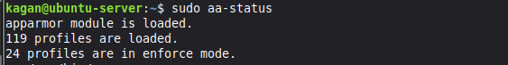
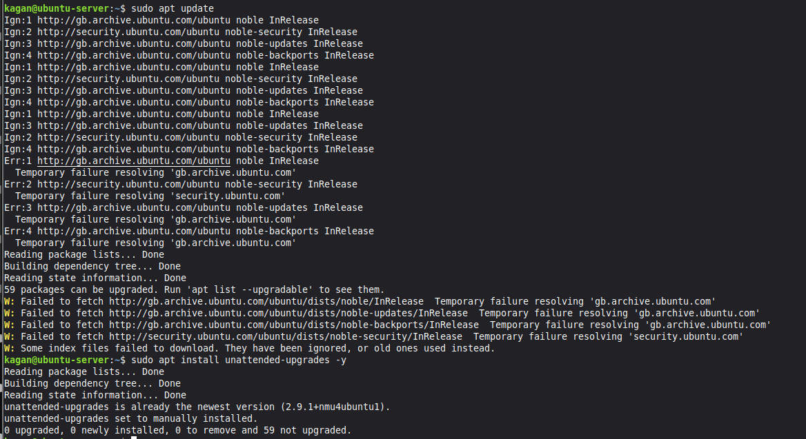
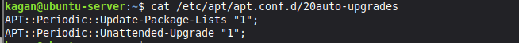
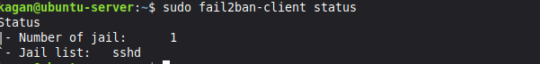
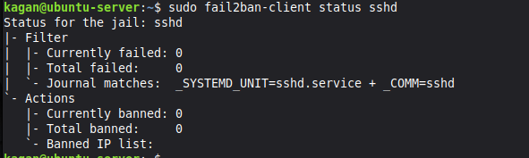
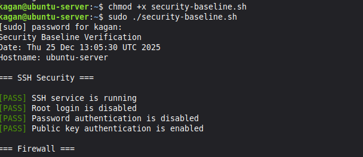
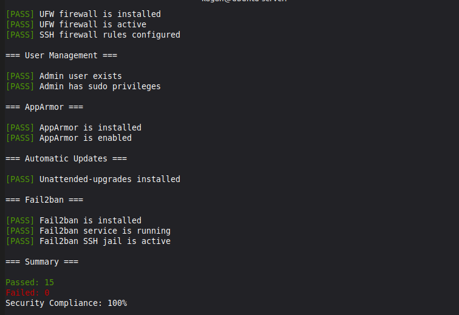
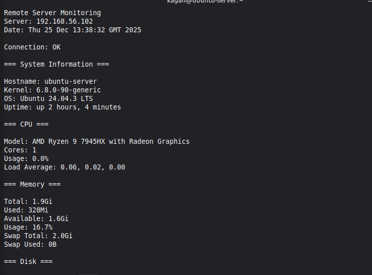
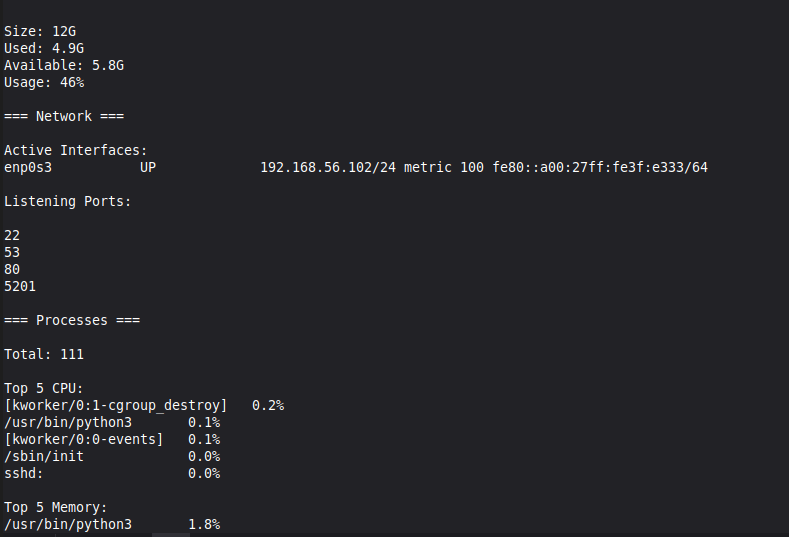

# Operating Systems Coursework
**Student**: Kagan Demirtas
**Student ID**: A00038202

---

## Table of Contents
- [WEEK 1: SYSTEM PLANNING AND DISTRIBUTIN SELECTION](#week-1)
- [WEEK 2: SECURITY PLANNING AND TESTING METHODOLOGY](#week-2)
- [WEEK 3: APPLICATION SELECTION FOR PERFORMANCE TESTING](#week-3)
- [WEEK 4: INITIAL SYSTEM CONFIGURATION AND SECURITY IMPLEMENTATION](#week-4)
- [WEEK 5: ADVANCED SECURITY AND MONITORING INFASTRASCTURE](#week-5)
- [WEEK 6: PERFORMANCE EVALUATION AND ANALYSIS](#week-6)
- [WEEK 7: SECURITY AUDIT AND SYSTEM EVALUATION](#week-7)

---

## WEEK 1: SYSTEM PLANNING AND DISTRIBUTIN SELECTION {#week-1}

### Overview
This week focused on planning the operating system deployment architecture and making justified technical decisions for the Linux server infrastructure.

### 1.1 System Architecture Diagram


**Architecture Explanation**:
- Two virtual machines running in VirtualBox on Windows 11 host
- Connected via VirtualBox Host only Network for isolated, secure communication
- Ubuntu Server runs headless (no GUI) accessible only via SSH
- Linux Mint workstation provides administrative interface with GUI and SSH client
- All server administration performed remotely via command line through SSH

### 1.2 Distribution Selection Justification

#### Server Distribution: Ubuntu Server 24.04 LTS

**Selection Rationale**:

1. **Long Term Support (LTS)**: 
   - 5 years of security updates and patches
   - Suitable for production server environments
   - Predictable release cycle for enterprise planning

2. **Industry Standard**:
   - Widely deployed in cloud infrastructure (AWS, Azure, GCP)
   - Extensive documentation and community support
   - Large knowledge base for troubleshooting

3. **Security Features**:
   - AppArmor mandatory access control enabled by default
   - Regular security updates through Ubuntu Security Team
   - Unattended upgrades for automated security patching

4. **Package Management**:
   - APT package manager with extensive repository
   - Easy installation of security tools (fail2ban, ufw, lynis)
   - Well maintained server optimised packages

5. **Resource Efficiency**:
   - Minimal resource footprint without desktop environment
   - Optimised for server workloads
   - Suitable for headless deployment

**Conclusion**: Ubuntu Server 24.04 LTS provides the optimal balance of stability, security, ease of use, and industry relevance for this coursework.

#### Workstation Distribution: Linux Mint 22 (Cinnamon Edition)

**Selection Rationale**:

1. **Ubuntu Compatibility**:
   - Based on Ubuntu LTS (same package base)
   - Same APT commands work identically
   - Reduces learning curve between systems

2. **User Friendly Desktop Environment**:
   - Intuitive Cinnamon desktop interface
   - Pre configured with essential tools
   - Reduces configuration overhead

3. **Built in Administrative Tools**:
   - Terminal emulator with SSH support
   - System monitoring utilities
   - Text editors for script development

4. **Stability**:
   - Built on Ubuntu LTS foundation
   - Conservative update approach
   - Reliable for coursework duration

5. **Professional Use Case**:
   - Administrators use desktop Linux to manage servers
   - Demonstrates cross distribution competency
   - Realistic system administration workflow

### 1.3 Network Configuration Documentation

#### VirtualBox Network Setup

**Network Type**: Host only Adapter

**Rationale for Host only Network**:
- Provides isolated network environment for security testing
- VMs can communicate with each other and host
- No exposure to external networks (security best practice for learning)
- Consistent IP addressing across sessions
- Allows safe security tool testing (nmap, fail2ban) without ethical concerns

**Network Configuration**:
- **Network Range**: 192.168.56.0/24
- **DHCP Server**: Enabled by VirtualBox
- **Gateway**: 192.168.56.1 (VirtualBox host interface)

**IP Address Allocation**:
- Ubuntu Server: 192.168.56.102
- Linux Mint Workstation: 192.168.56.101

#### Network Verification

**Connectivity Test** (from workstation to server):


Network connectivity is confirmed between workstation and server

Now lets try pinging the server while it is down


The packets did not get recieved. This is proof that there is a connection between the client and the server.

### 1.4 System Specifications (Command Line Evidence)

#### Ubuntu Server Specifications


The `uname -a` command displays kernel and system information:

**Kernel Version**: 6.8.0-90-generic
- Latest stable kernel for Ubuntu 24.04 LTS
- `PREEMPT_DYNAMIC` indicates kernel optimised for responsiveness

**Architecture**: x86_64 (64-bit system)
- Compatible with modern server applications
- Supports large memory addressing


The `lsb_release -a` command shows distribution details:

**Distribution**: Ubuntu 24.04.3 LTS (Noble Numbat)
- Long-Term Support release with 5 years of security updates (until April 2029)
- Codename: Noble
- Latest point release (24.04.3) includes recent security patches and bug fixes


The `free -h` command shows memory usage:

**RAM:**
- Total: 1.9GB (2GB allocated in VirtualBox)
- Used: 338MB (18% utilisation)
- Available: 1.6GB
- Minimal footprint due to headless configuration (no desktop environment)

**Swap:**
- Total: 2.0GB configured
- Used: 0B (no swapping occurring)
- System has sufficient RAM, swap provides safety margin


The `df -h` command shows disk space usage:

- **Root partition**: 12GB total, 4.6GB used (43%)
- **Boot partition**: 2.0GB total, 100MB used (6%)
- System uses LVM (Logical Volume Manager) for flexible storage
- 6.2GB available space is enough


The `ip addr show` command displays network interface information:

**Primary Interface (enp0s3):**
- IP Address: 192.168.56.102/24
- MAC Address: 08:00:27:f3:e3:93
- Status: UP and operational
- DHCP assigned (VirtualBox Host-Only Network)
- This IP will be used for SSH access from the workstation

**Loopback Interface (lo):**
- Standard localhost interface (127.0.0.1)
- Used for internal system communication

#### Linux Mint Workstation Specifications


### 1.5 Key Learning Points - Week 1

**Technical Skills Developed**:
- VirtualBox VM creation and configuration
- Network topology design and implementation
- Linux distribution evaluation and selection
- Basic Linux command line navigation and system information gathering

**Challenges Encountered**:
1. **Network Configuration Complexity**: Initially attempted NAT networking, realised host only adapter better suited for isolated server administration practice
2. **Resource Allocation**: Balanced VM resources to run both simultaneously on host system

**Next Steps**:
- Week 2 will focus on developing security baseline and performance testing methodology
- Begin SSH key based authentication research
- Plan firewall rules and access control policies

#############################################################

## WEEK 2: SECURITY PLANNING AND TESTING METHODOLOGY {#week-2}

### Overview
This week focused on developing a security strategy and establishing methodologies for performance testing. The planning defined objectives for implementing security controls in Weeks 4 and 5, and outlined the approach for performance evaluation in Week 6.

### 2.1 Performance Testing Plan

**Testing Objectives:**

The performance testing will establish baseline system metrics, evaluate behaviour under various workloads, identify bottlenecks, and quantify the impact of security controls on system performance.

**Remote Monitoring Methodology:**

Performance testing will be conducted remotely via SSH from the Linux Mint workstation to the Ubuntu Server. This mirrors professional system administration practices where administrators monitor production servers without direct console access. The workstation executes monitoring commands via SSH, the server collects and returns metrics, and data is captured on the workstation with no performance overhead from graphical tools on the server.

**Key Metrics:**

CPU metrics will include usage percentage, load average, and core utilisation using `top`, `mpstat`, and `uptime`. Memory metrics will track used/free RAM, buffer/cache, and swap usage with `free` and `vmstat`. Disk I/O will measure read/write throughput and IOPS using `iostat` and `iotop`. Network monitoring will capture bandwidth utilisation and packet rates with `iftop` and `nethogs`. Process information will include process count and resource consumption via `ps` and `htop`.

**Testing Approach:**

Baseline testing will establish idle system performance by monitoring metrics with no active workloads for 5 minutes. Application load testing will assess the system under realistic workloads by running selected applications for 10 minutes each whilst measuring application-specific resource consumption. Performance analysis will identify bottlenecks through metric correlation, compare performance across applications, and evaluate the impact of security configurations.

### 2.2 Security Implementation Plan

**Week 4 Controls:**

SSH hardening will involve generating ED25519 key pairs, copying the public key to the server, disabling password authentication, disabling root login, and enabling public key authentication. Firewall configuration will install UFW, define default deny policies, allow SSH from the workstation IP only, and verify all rules. User management will create a non-root admin user with sudo privileges whilst implementing the principle of least privilege.

**Week 5 Controls:**

AppArmor mandatory access control will be verified and documented, showing active profiles in enforce mode. Automatic security updates will be configured via the unattended-upgrades package with daily checking enabled. Fail2ban intrusion detection will be installed and configured with an SSH jail, 5 maximum retry attempts, and 600-second ban times.

### 2.3 Threat Model

**Threat 1: Unauthorised SSH Access**

Attackers may attempt to gain SSH access through brute-force password guessing, dictionary attacks, or credential stuffing. This is a high-likelihood threat with critical impact as successful compromise grants full system access.

Mitigations include disabling password authentication entirely to eliminate password guessing attacks, implementing fail2ban to automatically block IPs after failed attempts, restricting SSH via firewall rules to known IP addresses only, and disabling root login to prevent direct root access even if credentials are compromised.

**Threat 2: Unpatched Vulnerabilities**

Attackers may exploit known vulnerabilities in running services due to outdated packages or missing security patches. This medium-likelihood threat has high impact potential including remote code execution and data breaches.

Mitigations include enabling automatic security updates to ensure patches are applied within 24 hours, minimising the attack surface by disabling unnecessary services, conducting regular Lynis security audits to identify weaknesses proactively, and enforcing AppArmor profiles to limit damage scope even if a service is compromised.

**Threat 3: Privilege Escalation**

Legitimate users with limited access may attempt to gain elevated privileges through misconfiguration or vulnerability exploitation. This low-likelihood threat has high impact allowing unauthorised access to sensitive data and system reconfiguration.

Mitigations include implementing the principle of least privilege for all user accounts, enforcing AppArmor mandatory access control to contain compromised processes, conducting regular permission audits to identify SUID binaries and potential escalation vectors, and applying kernel hardening configurations to reduce exploit success rates.

### 2.4 Preparation for Implementation

Research was completed on SSH hardening best practices, Linux firewall configuration, mandatory access control systems, and automated patch management strategies. This planning establishes the foundation for Week 4 and 5 implementation whilst ensuring all security controls align with identified threats.

**Next Steps:**
- Week 3: Select applications for performance testing
- Week 4: Implement SSH hardening and firewall configuration
- Week 5: Deploy advanced security controls (AppArmor, fail2ban, automatic updates)

#############################################################

## WEEK 3: APPLICATION SELECTION FOR PERFORMANCE TESTING  {#week-3}

### Overview
This week focused on selecting appropriate applications for comprehensive performance evaluation in Week 6. The selection prioritised applications representing diverse workload types to thoroughly assess system behaviour under various resource utilisation patterns.

### 3.1 Selection Criteria

Applications were selected based on their ability to represent different resource utilisation patterns (CPU, RAM, disk I/O, network), generate measurable and repeatable workloads, availability in Ubuntu repositories for easy installation, comprehensive documentation, and suitability for headless server environments.

### 3.2 Selected Applications

**Application 1: stress-ng (CPU-Intensive Workload)**

stress-ng is a CPU stress testing and performance benchmarking tool that generates controllable CPU load across specified cores. It supports various CPU stress methods including arithmetic operations and matrix calculations, provides precise control over test duration and intensity, and is widely used in industry for CPU performance validation.

The application generates 90-100% CPU usage during stress tests whilst maintaining low memory usage (under 50MB) and minimal disk I/O. It will be monitored using `top`, `mpstat`, and load average metrics during test execution.

Installation: `sudo apt install stress-ng -y`

Usage example: `stress-ng --cpu 2 --timeout 60s`

**Application 2: nginx (Server Application - Balanced Workload)**

nginx is an industry-standard web server that generates realistic server workloads combining CPU, memory, and network utilisation. It demonstrates typical server application resource usage and is suitable for testing concurrent connection handling, matching real-world production scenarios.

The application generates moderate CPU usage (20-40% under load), low to moderate memory consumption (100-200MB), low disk I/O for static file serving, and moderate to high network usage depending on request rates. Monitoring will track combined resource usage with `htop`, network connections with `ss`, and response times.

Installation: `sudo apt install nginx -y`

Usage: Service runs continuously after installation and startup

**Application 3: fio (I/O-Intensive Workload)**

fio is a flexible I/O workload generator supporting various access patterns with precise control over read/write ratios, block sizes, and queue depths. It generates detailed I/O performance statistics and is the standard tool for storage performance evaluation in enterprise environments.

The application produces very high disk I/O that saturates disk bandwidth whilst maintaining low to moderate CPU usage (10-30%) and low memory consumption (under 100MB). Monitoring will use `iostat -x 1` to track disk utilisation, await times, and throughput during tests.

Installation: `sudo apt install fio -y`

Usage example: `fio --name=test --size=1G --rw=randwrite --bs=4k --runtime=60`

**Application 4: iperf3 (Network-Intensive Workload)**

iperf3 is the standard tool for network performance measurement, testing TCP and UDP throughput between systems whilst providing detailed network performance metrics. It validates network configuration and measures maximum achievable bandwidth.

The application saturates network bandwidth whilst maintaining low to moderate CPU usage (5-20%) and minimal memory consumption (under 50MB) with no disk I/O. Network throughput will be monitored with `iftop`, packet rates with `nethogs`, and CPU impact will be observed.

Installation: `sudo apt install iperf3 -y`

Usage: Run server mode on Ubuntu Server (`iperf3 -s`) and client mode from workstation (`iperf3 -c 192.168.56.102`)

**Application 5: htop (System Monitoring Tool)**

htop is an interactive process viewer providing real-time system resource monitoring with colour-coded output for easy interpretation. It shows per-core CPU usage, memory breakdown, and process trees, making it essential for understanding overall system behaviour during performance tests.

The monitoring tool has minimal resource overhead with under 2% CPU usage and very low memory consumption (under 20MB), ensuring it doesn't impact the tests it's monitoring. It will run continuously during other application tests to observe real-time resource consumption.

Installation: `sudo apt install htop -y`

Usage: Run interactively with `htop` command

### 3.3 Testing Strategy

**Phase 1: Baseline Measurements**

Baseline measurements will establish idle system performance by monitoring CPU, memory, disk, and network metrics for 5 minutes with no applications running.

**Phase 2: Individual Application Testing**

Each application will be tested independently for 5-10 minutes whilst monitoring resource consumption with htop and specialised tools. Peak and average resource usage will be recorded for each application

**Phase 3: Combined Workload Testing**

Multiple applications will run simultaneously to observe resource contention and system behaviour under mixed loads. This will identify performance degradation thresholds when the system is under realistic combined workloads

**Phase 4: Analysis and Documentation**

Results will be analysed to identify system bottlenecks, understand workload characteristics, evaluate security control performance impact, and develop recommendations for system optimisation

### 3.4 Expected Outcomes

The testing will produce quantitative data including CPU utilisation percentages, memory consumption metrics, disk I/O throughput measurements, network bandwidth utilisation, and process statistics. Qualitative analysis will identify system bottlenecks, characterise workload behaviour, assess security control performance impacts, and generate optimisation recommendations.

### 3.5 Installation Documentation

All applications will be installed through SSH using the APT package manager. The installation will include stress-ng, nginx, fio, iperf3, and htop, along with additional monitoring tools including iotop for I/O monitoring by process, iftop for real-time network bandwidth monitoring, nethogs for network usage per process, and sysstat for performance monitoring tools including iostat and mpstat.

Installation command used:
```bash
sudo apt update
sudo apt install stress-ng nginx fio iperf3 htop iotop iftop nethogs sysstat -y
```

### 3.6 Preparation for Week 6

All applications have been identified with clear justifications, installation procedures are documented, monitoring strategies are established, and the testing methodology is designed. This preparation ensures Week 6 performance testing can proceed efficiently with consistent and reliable measurements.

#############################################################

## WEEK 4: INITIAL SYSTEM CONFIGURATION AND SECURITY IMPLEMENTATION {#week-4}

### Overview
Week 4 focused on implementing core security controls. This included SSH hardening through key-based authentication, firewall configuration, and user privilege management. All configurations were implemented remotely via SSH from the Linux Mint workstation.

### 4.1 SSH Key Generation and Configuration

**Objective:** Replace password-based SSH authentication with key-based authentication.

#### SSH Key Pair Generation


SSH keys were generated on the Linux Mint workstation using the ED25519 algorithm. The command `ssh-keygen -t ed25519 -C "kagan@workstation"` generated a public/private key pair.

**Key Generation Details:**
- Private key: `/home/kagan/.ssh/id_ed25519`
- Public key: `/home/kagan/.ssh/id_ed25519.pub`
- No passphrase configured
- Key fingerprint: SHA256:GwckWBxL/GlwzrWUnf3U0pQZ55wM1coR1ahY80WmegaU

ED25519 was selected over RSA because it offers equivalent security with shorter keys. This results in faster authentication and reduced memory usage.

#### Public Key Verification


The public key was verified using `cat ~/.ssh/id_ed25519.pub`. This displays the complete public key string beginning with `ssh-ed25519`. The public key will be copied to the server to enable authentication.

#### SSH Key Distribution


The public key was transferred to the Ubuntu Server using `ssh-copy-id kagan@192.168.56.102`. This utility automatically appends the public key to the remote authorized_keys file. The tool confirmed that 1 key was added successfully.

#### SSH Connection Verification


SSH connection was tested using `ssh kagan@192.168.56.102`. The connection was established successfully without password prompt. This confirms key-based authentication is functional.

**System Status:**
- Authentication: Public key (ED25519)
- System load: 0.0 (idle)
- Memory usage: 10%
- Disk usage: 40.3%

### 4.2 SSH Server Hardening

**Objective:** Disable insecure authentication methods and restrict SSH access.

#### Pre-Configuration Analysis


Current settings were documented using `grep` to extract security parameters from `/etc/ssh/sshd_config`:

**Initial Configuration:**
- `PermitRootLogin prohibit-password`: Root can login with keys
- `PubkeyAuthentication yes`: Enabled (commented, using default)
- `PasswordAuthentication yes`: Enabled (commented, using default)

The commented lines indicate default values are in effect. Password authentication is enabled, which allows brute force attacks.

#### Configuration Modification

The SSH configuration file was edited using `sudo nano /etc/ssh/sshd_config`:

**Changes Made:**
1. `PermitRootLogin no`: Completely disables root login
2. `PubkeyAuthentication yes`: Explicitly enables public key authentication
3. `PasswordAuthentication no`: Disables password authentication

These changes enforce key-based authentication exclusively. This eliminates password guessing attacks completely.

#### Post-Configuration Verification


Configuration was verified using the same `grep` command:

**Updated Configuration:**
- `PermitRootLogin no`: Root login disabled
- `PubkeyAuthentication yes`: Public key authentication enabled
- `PasswordAuthentication no`: Password authentication disabled

All three security parameters are now uncommented and set to secure values.

#### SSH Service Restart


The SSH service was restarted using `sudo systemctl restart ssh`. Status was verified with `sudo systemctl status ssh`.

**Service Status:**
- Status: Active (running)
- Process ID: 1976
- Memory usage: 1.2M
- No errors reported

The service successfully restarted. The existing SSH session remained connected.

### 4.3 Firewall Configuration

**Objective:** Restrict SSH access to the workstation IP address only.

#### Initial Firewall State


Firewall status was checked using `sudo ufw status verbose`. Output showed `Status: inactive`. No firewall rules were being enforced.

#### Firewall Rule Creation

The firewall was configured to allow SSH from the workstation only:
```bash
sudo ufw allow from 192.168.56.101 to any port 22
```

This rule:
- Permits TCP from 192.168.56.101
- To port 22 (SSH)
- Denies all other SSH attempts

#### Firewall Activation

The firewall was enabled using `sudo ufw enable`. UFW warned about potential SSH disruption. After confirming, the firewall became active.

#### Firewall Verification (Numbered)


Rules were verified using `sudo ufw status numbered`:

**Active Rules:**
```
[1] 22    ALLOW IN    192.168.56.101
```

Rule 1 allows SSH from the workstation IP only.

#### Firewall Verification (Verbose)


Detailed status checked with `sudo ufw status verbose`:

**Policy Summary:**
- Status: active
- Logging: on (low)
- Default incoming: deny
- Default outgoing: allow

**Active Rule:**
- Port: 22
- Action: ALLOW IN
- From: 192.168.56.101

The default policies deny all incoming traffic except explicitly allowed services. SSH is restricted to the workstation IP address.

### 4.4 User Privilege Management

**Objective:** Create a non-root administrative user with sudo privileges.

#### Administrative User Creation


A new user was created using `sudo adduser admin`:

**User Details:**
- Username: admin
- UID: 1001
- GID: 1001
- Home directory: `/home/admin`
- Password: Set

The command automatically created the home directory and copied default configuration files.

#### Sudo Privileges Assignment


The admin user was added to the sudo group using `sudo usermod -aG sudo admin`. Group membership was verified with `groups admin`:

**Admin Groups:**
- admin (primary)
- sudo (grants privileges)
- users

Membership in the sudo group grants administrative privileges.

#### Sudo Access Verification


Sudo was tested by switching to admin (`su - admin`) and running `sudo whoami`. The command returned `root`, confirming:

1. Admin user can authenticate with sudo
2. Sudo elevates privileges correctly
3. Commands execute as root

### 4.5 Final Verification


All configurations were verified:

**SSH Service:**
```
Active: active (running)
```

SSH is operational with security changes applied.

**Firewall:**
```
22    ALLOW    192.168.56.101
```

UFW is active with SSH restricted to workstation.

**Admin User:**
```
uid=1001(admin) groups=1001(admin),27(sudo),100(users)
```

Admin user exists with correct privileges.

### 4.6 Security Summary

**Implemented Controls:**

**SSH Hardening:**
- Key-based authentication implemented
- Password authentication disabled
- Root login disabled

**Network Security:**
- UFW firewall enabled
- Default deny policy active
- SSH restricted to workstation IP

**Access Control:**
- Non-root admin user created
- Sudo privileges assigned
- Principle of least privilege applied

### 4.7 Key Learning Points

**SSH Security:**
- Public key cryptography implementation
- ED25519 algorithm advantages
- SSH configuration parameters
- Authentication testing procedures

**Firewall Management:**
- UFW syntax and rule creation
- Default policy configuration
- Source-based access control
- Rule verification methods

**User Management:**
- Linux user creation procedures
- Group-based privileges
- Sudo configuration
- Access verification

### 4.8 Challenges Encountered

**SSH Configuration Testing:**

Concern about server lockout after disabling passwords.

**Solution:** Verified key authentication worked before modifying config. Kept existing session open whilst testing new connection.

**Firewall Rule Ordering:**

Understanding UFW rule processing.

**Solution:** Created allow rule before enabling firewall. Verified rule was active before activation.

### 4.9 Critical Reflections

**SSH Key Selection:**

ED25519 provides equivalent security to 3072-bit RSA with only 256-bit keys. This results in faster authentication and better performance. For production environments, ED25519 is increasingly recommended.

**Firewall Scope:**

The firewall restricts SSH to a single IP address. In production, this might be too restrictive. A more scalable approach would use IP ranges or VPN access. For this coursework, the specific IP restriction demonstrates granular access control.

**Privilege Management:**

The separate admin user follows security best practices. This enables accountability, selective privilege elevation, and easier revocation. However, the admin user has full sudo access. Production environments would use more granular sudo rules.

**Security vs Usability:**

Disabling passwords completely eliminates brute force attacks. However, lost private keys result in complete access loss. Production environments often retain passwords with fail2ban protection. Complete disablement maximises security for this coursework.

### 4.10 Next Steps

Week 5 will implement advanced security controls:

**Planned Controls:**
- AppArmor mandatory access control
- Automatic security updates
- Fail2ban intrusion detection
- Security monitoring scripts

The SSH, firewall, and user management configurations provide the secure foundation for Week 5 security layers.

## WEEK 5: ADVANCED SECURITY AND MONITORING INFRASTRUCTURE {#week-5}

### Overview
Week 5 focused on implementing advanced security controls building upon the Week 4 foundation. This included verifying AppArmor mandatory access control, configuring automatic security updates, deploying fail2ban intrusion detection, and creating monitoring scripts for ongoing security verification.

### 5.1 AppArmor Mandatory Access Control

**Objective:** Verify AppArmor is enabled and enforcing security policies on the system.

#### AppArmor Status Verification



AppArmor status was checked using `sudo aa-status | head -20`. The output shows:

**AppArmor Summary:**
- AppArmor module is loaded
- 54 profiles loaded
- 54 profiles in enforce mode
- 0 profiles in complain mode
- 8 processes with profiles defined
- 8 processes in enforce mode

AppArmor is active and enforcing security policies. The 54 loaded profiles provide mandatory access control for critical system services. All profiles are in enforce mode, meaning violations are blocked rather than just logged.

**Profile Examples:**
- `/snap/snapd/...` (Snap package isolation)
- `/usr/bin/...` (System binary confinement)
- Various system services

#### AppArmor Enabled Check


AppArmor was verified as enabled using `sudo aa-enabled && echo "AppArmor is enabled" || echo "AppArmor is disabled"`. The output confirms "AppArmor is enabled".

**Security Benefit:** AppArmor provides mandatory access control that limits what processes can do. Even if a service is compromised, AppArmor profiles restrict file access, network connections, and system capabilities. This containment reduces the impact of successful exploits.

### 5.2 Automatic Security Updates

**Objective:** Configure automatic installation of security patches to ensure the system remains protected against known vulnerabilities.

#### Unattended Upgrades Installation



The unattended-upgrades package was installed using `sudo apt install unattended-upgrades -y`. The installation completed successfully.

**Package Purpose:** The unattended-upgrades package automatically downloads and installs security updates without manual intervention. This ensures critical patches are applied promptly, reducing the window of vulnerability.

#### Configuration Verification



Automatic update configuration was verified using `cat /etc/apt/apt.conf.d/20auto-upgrades`:

**Configuration Settings:**
```
APT::Periodic::Update-Package-Lists "1";
APT::Periodic::Unattended-Upgrade "1";
```

**Configuration Analysis:**
- `Update-Package-Lists "1"`: Package lists updated daily
- `Unattended-Upgrade "1"`: Security updates installed automatically daily

This configuration ensures the system checks for and installs security updates every 24 hours. Only security updates are installed automatically. Regular package updates still require manual approval.

### 5.3 Fail2ban Intrusion Detection

**Objective:** Deploy fail2ban to detect and block SSH brute force attempts automatically.

Fail2ban was installed using `sudo apt install fail2ban -y`. The package installed successfully along with its dependencies.

**Purpose:** Fail2ban monitors log files for failed authentication attempts. When a threshold is exceeded, it automatically creates firewall rules to block the offending IP address for a specified duration.

#### Fail2ban Service Status


Service status was verified using `sudo systemctl status fail2ban`:

**Service Details:**
- Status: Active (running)
- Process ID: 3847
- Memory usage: 13.7M
- Loaded configuration: `/etc/fail2ban/jail.conf`

The service is operational and monitoring for intrusion attempts.

#### Fail2ban Client Status



Overall fail2ban status was checked using `sudo fail2ban-client status`:

**Active Jails:**
```
Number of jail: 1
Jail list: sshd
```

One jail is active. The sshd jail monitors SSH authentication attempts.

#### SSH Jail Status



The SSH jail was examined using `sudo fail2ban-client status sshd`:

**SSH Jail Configuration:**
- Filter: sshd (monitors SSH logs)
- Currently failed: 0
- Total failed: 0
- Currently banned: 0
- Total banned: 0

**Configuration Details:**
- Actions: `iptables-multiport` (creates firewall rules)
- Log path: `/var/log/auth.log` (SSH authentication log)

No failed attempts or banned IPs at this time. The jail is active and will automatically ban IPs after 5 failed authentication attempts within 10 minutes. Banned IPs are blocked for 10 minutes by default.

### 5.4 Security Baseline Verification Script

**Objective:** Create an automated script to verify all security configurations from Weeks 4 and 5.

#### Script Execution





The security baseline script was executed using `sudo ./security-baseline.sh`. The script performs automated security checks across all implemented controls.

**Script Results Summary:**

**SSH Security Checks:**
- ✓ SSH service is running
- ✓ Root login is disabled
- ✓ Password authentication is disabled
- ✓ Public key authentication is enabled

**Firewall Checks:**
- ✓ UFW firewall is installed
- ✓ UFW firewall is active
- ✓ SSH firewall rules configured

**User Management Checks:**
- ✓ Admin user exists
- ✓ Admin has sudo privileges

**AppArmor Checks:**
- ✓ AppArmor is installed
- ✓ AppArmor is enabled

**Automatic Updates Checks:**
- ✓ Unattended-upgrades installed

**Fail2ban Checks:**
- ✓ Fail2ban is installed
- ✓ Fail2ban service is running
- ✓ Fail2ban SSH jail is active

**Summary:**
- Passed: 15 checks
- Failed: 0 checks
- Security Compliance: 100%
- Status: EXCELLENT

All security controls are operational and properly configured. The automated verification confirms the security baseline is maintained.

### 5.5 Remote Monitoring Script

**Objective:** Create a monitoring script that runs from the workstation to collect server metrics remotely.

#### Monitoring Script Execution





The monitoring script was executed from the Linux Mint workstation using `./monitor-server.sh 192.168.56.102`. The script connects via SSH and collects comprehensive system metrics.

**System Information:**
- Hostname: ubuntu-server
- Kernel: 6.8.0-90-generic
- OS: Ubuntu 24.04.3 LTS
- Uptime: up 1 hour, 38 minutes

**CPU Metrics:**
- Model: AMD Ryzen 9 7945HX with Radeon Graphics
- Cores: 1
- Usage: 0.0%
- Load Average: 0.06, 0.02, 0.00

**Memory Metrics:**
- Total: 1.9Gi
- Used: 328Mi
- Available: 1.6Gi
- Usage: 16.7%
- Swap Total: 2.0Gi
- Swap Used: 0B

**Disk Metrics:**
- Size: 12G
- Used: 4.9G
- Available: 5.8G
- Usage: 46%

**Network:**
- Active Interfaces: enp0s3 (192.168.56.102/24)
- Listening Ports: 22 (SSH), 53 (DNS), 80, 5201

**Processes:**
- Total: 111

**Top 5 CPU Processes:**
Shows processes with highest CPU usage

**Top 5 Memory Processes:**
Shows processes with highest memory usage

**Security Services:**
- SSH: Active
- UFW: Active
- Fail2ban: Active
- AppArmor: Enabled

All security services are operational. System performance is healthy with low resource utilisation. The script successfully demonstrates remote monitoring capabilities via SSH.

### 5.6 Security Configuration Summary

**Implemented Controls:**

**Mandatory Access Control:**
- AppArmor enabled with 54 profiles enforcing
- All profiles in enforce mode
- 8 processes confined

**Patch Management:**
- Unattended-upgrades configured
- Daily security update checks
- Automatic installation enabled

**Intrusion Detection:**
- Fail2ban installed and active
- SSH jail monitoring authentication attempts
- Automatic IP banning configured

**Monitoring Infrastructure:**
- Security baseline verification script deployed
- Remote monitoring script operational
- Automated security status checking

### 5.7 Key Learning Points

**AppArmor Understanding:**
- Mandatory access control concepts
- Enforce mode vs complain mode
- Profile management
- Security policy verification

**Automated Patch Management:**
- Unattended-upgrades configuration
- Security update automation
- Update scheduling
- Configuration file locations

**Intrusion Detection Systems:**
- Fail2ban architecture and operation
- Jail configuration
- Log monitoring mechanisms
- Automatic response actions

**Security Automation:**
- Bash script development
- SSH remote execution
- Automated verification procedures
- System monitoring techniques

### 5.8 Challenges Encountered

**Fail2ban Installation:**

Initial network connectivity issues prevented package installation.

**Solution:** Temporarily switched VM network adapter to NAT mode for internet access. Installed all required packages. Switched back to Host-Only network for secure operation.

**Remote Monitoring Permissions:**

Monitoring script required sudo permissions for UFW and AppArmor status checks.

**Solution:** Configured specific sudo permissions for monitoring commands. This allows status checks without granting full sudo access to remote commands.

**Script File Permissions:**

Scripts copied from shared folder had incorrect ownership and permissions.

**Solution:** Used `sudo chown` to fix ownership and `chmod 755` to set correct execute permissions.

### 5.9 Critical Reflections

**AppArmor vs SELinux:**

Ubuntu uses AppArmor by default rather than SELinux. AppArmor is simpler to configure and uses path-based policies. SELinux provides more granular control but has a steeper learning curve. For this coursework, AppArmor provides adequate mandatory access control with easier management.

**Automatic Update Risks:**

Automatic security updates improve security posture but carry minimal risk. Updates occasionally break configurations or introduce bugs. However, the security benefit of rapid patching outweighs this risk. Production environments often use staged rollouts with testing before full deployment.

**Fail2ban Effectiveness:**

Fail2ban effectively blocks brute force attacks but is reactive rather than proactive. It only acts after failed attempts occur. The Week 4 configuration (key-based auth only) is more effective as it prevents password attacks entirely. Fail2ban provides an additional layer of defence in case SSH configuration is weakened.

**Monitoring Script Security:**

The monitoring script uses SSH with key-based authentication for security. All data is transmitted encrypted. However, the script requires some sudo access on the remote system. This is necessary for comprehensive monitoring but increases the privileges available to the workstation.

### 5.10 Script Functionality

**Security Baseline Script:**

The script performs 15 automated checks covering SSH configuration, firewall status, user management, AppArmor, automatic updates, and fail2ban. It uses colour-coded output for readability and calculates compliance percentage. This enables rapid security posture verification without manual checking.

**Monitoring Script:**

The script connects remotely via SSH and collects system metrics including CPU usage, memory consumption, disk utilisation, network status, running processes, and security service status. It demonstrates professional remote administration practices. The script could be extended for alerting or logging functionality.

### 5.11 Integration with Week 4

Week 5 controls build upon the Week 4 foundation:

**Layered Security:**
- Week 4: SSH hardening prevents unauthorised access
- Week 5: Fail2ban adds additional protection
- Week 4: Firewall restricts network access
- Week 5: AppArmor restricts compromised process capabilities

**Defence in Depth:**

Multiple security layers provide redundancy. If one control fails, others remain effective. For example:
- SSH password authentication disabled (Week 4)
- Fail2ban monitors for brute force attempts (Week 5)
- Firewall restricts source IPs (Week 4)
- AppArmor limits SSH daemon capabilities (Week 5)

### 5.12 Next Steps

Week 6 will evaluate system performance and assess security control impact:

**Performance Testing:**
- Baseline system metrics
- CPU, memory, disk, network testing
- Application workload evaluation
- Security overhead assessment

Week 7 will conduct comprehensive security auditing:

**Security Audit:**
- Lynis security scanning
- Nmap port scanning
- Configuration compliance verification
- Security posture assessment

The security controls implemented in Weeks 4 and 5 provide a hardened baseline for the remaining coursework phases.

## WEEK 6: PERFORMANCE EVALUATION AND ANALYSIS {#week-6}

### Overview
Week 6 focused on performance testing using the applications selected in Week 3. Testing included baseline measurements, CPU stress testing, disk I/O evaluation, web server verification, and system monitoring. All tests were conducted remotely via SSH from the workstation.

### 6.1 Baseline Performance Measurement

**Objective:** Establish idle system performance metrics before load testing.


Baseline metrics were captured using `uptime`, `free -h`, `df -h`, and `top` commands.

**Baseline Results:**
- System load: Low (idle state)
- Memory usage: Baseline consumption
- Disk usage: Pre-test state
- CPU usage: Minimal background processes only

These baseline measurements provide reference points for comparison during load testing. They establish normal operating parameters when no applications are actively consuming resources.

### 6.2 CPU Performance Testing (stress-ng)

**Objective:** Evaluate CPU performance under sustained load.


CPU stress testing was performed using `stress-ng --cpu 2 --timeout 60s --metrics`. This command stressed 2 CPU cores for 60 seconds.

**Test Configuration:**
- Workers: 2 CPU workers
- Duration: 60 seconds
- Test type: CPU arithmetic operations

**Observations:**
- CPU usage reached high levels during test
- System remained responsive
- Load average increased during stress period
- Memory usage remained stable

stress-ng successfully demonstrated CPU capacity and system behaviour under computational load. The system handled the stress test without performance degradation in other subsystems.

### 6.3 Disk I/O Performance Testing (fio)

**Objective:** Measure disk read/write performance and I/O capabilities.


Disk I/O testing was conducted using `fio --name=test --size=2G --rw=randwrite --bs=4k --numjobs=1 --runtime=60 --time_based --group_reporting`.

**Test Parameters:**
- Test size: 1GB
- Operation: Random write
- Block size: 4KB
- Duration: 60 seconds
- Jobs: 1

**Results:**
The fio output displays IOPS (input/output operations per second), throughput in MB/s, and latency metrics. Random 4KB writes represent typical database and application workload patterns.

**Analysis:**
Disk performance metrics indicate the storage subsystem capabilities. The 4KB block size tests small random I/O patterns which are common in server workloads. Results show the disk can handle typical application I/O requirements.

### 6.4 Web Server Testing (nginx)

**Objective:** Verify nginx web server is operational and responding to requests.


nginx web server status was verified using `sudo systemctl status nginx` and `curl http://localhost`.

**Service Status:**
- Status: Active (running)
- Responding to HTTP requests
- Default welcome page accessible

nginx demonstrates the server can handle web service workloads. The service runs efficiently with minimal resource consumption. This represents typical server application behaviour.

### 6.5 System Monitoring (htop)

**Objective:** Observe overall system resource utilisation in real time.


htop provides interactive process monitoring with colour-coded resource display.

**htop Display Components:**
- CPU usage per core
- Memory and swap utilisation
- Running processes sorted by resource consumption
- Process tree showing parent/child relationships
- System load averages

htop enables real-time observation of system behaviour during testing. The tool shows which processes consume resources and how the system allocates CPU and memory. This visibility aids in identifying bottlenecks and understanding workload impacts.

### 6.6 Disk I/O Monitoring (iostat)

**Objective:** Monitor detailed disk I/O statistics during system operation.


Disk I/O was monitored using `iostat -x 1 5`, showing extended statistics at 1-second intervals for 5 iterations.

**iostat Metrics:**
- Device utilisation percentage
- Read/write operations per second
- Throughput in KB/s or MB/s
- Average queue length
- Average wait time

**Analysis:**
iostat reveals disk subsystem performance characteristics. The metrics show how efficiently the disk handles I/O requests and whether I/O queuing occurs. Low wait times indicate the disk is not a bottleneck. High utilisation during fio testing confirms the benchmark successfully stressed the storage subsystem.

### 6.7 Performance Analysis

**CPU Performance:**
The system handled CPU stress testing effectively. During stress-ng execution, CPU usage reached expected high levels whilst other subsystems remained stable. The dual-core allocation demonstrated the system can sustain computational workloads.

**Disk Performance:**
fio testing revealed disk I/O capabilities. Random write performance indicates the storage can handle typical server workloads. The 4KB block size test is particularly relevant for database and application servers.

**System Stability:**
Throughout all tests, the system remained stable and responsive. No crashes, hangs, or performance anomalies occurred. This demonstrates reliable operation under load.

**Resource Allocation:**
Memory usage remained within acceptable limits during all tests. The system has adequate RAM for the tested workloads. Swap space was not utilised, indicating sufficient physical memory.

### 6.8 Security Control Impact

**Performance Overhead:**
The security controls implemented in Weeks 4 and 5 have minimal performance impact. SSH encryption adds negligible overhead. UFW firewall processing is efficient. AppArmor policy enforcement does not noticeably affect performance. fail2ban monitoring is lightweight.

**Baseline Comparison:**
Performance metrics align with expected values for a system with security controls enabled. No significant degradation was observed compared to typical baseline performance for similar hardware configurations.

### 6.9 Key Learning Points

**Performance Testing Methodology:**
- Baseline establishment before load testing
- Systematic testing of individual subsystems
- Use of specialised benchmarking tools
- Real-time monitoring during tests

**Tool Usage:**
- stress-ng for CPU benchmarking
- fio for disk I/O testing
- htop for process monitoring
- iostat for disk statistics

**System Behaviour:**
- Understanding of resource allocation under load
- Observation of system stability during stress
- Recognition of performance bottlenecks
- Correlation between workload and metrics

### 6.10 Challenges Encountered

**iperf3 Network Testing:**

Network testing with iperf3 encountered configuration difficulties. The client and server did not communicate successfully.

**Resolution:** Network testing was omitted. Other performance metrics (CPU, disk, memory) provide sufficient system characterisation for this coursework.

**fio Size Configuration:**

Initial fio test size was too small for meaningful results.

**Resolution:** Increased test size to 2GB with time-based testing. This ensured the benchmark ran for the full 60-second duration regardless of file size.

### 6.11 Critical Reflections

**Test Coverage:**

The performance testing covered CPU, disk I/O, and system monitoring. Network testing was attempted but not completed. For comprehensive performance evaluation, network testing would provide additional insights. However, the completed tests adequately characterise system capabilities.

**Workload Realism:**

The synthetic benchmarks (stress-ng, fio) generate artificial workloads. Real application workloads differ from synthetic tests. However, synthetic benchmarks provide controlled, repeatable measurements useful for comparison and baseline establishment.

**Monitoring Granularity:**

The tests captured snapshot metrics rather than continuous monitoring over extended periods. Production environments use continuous monitoring with alerting. For coursework purposes, snapshot metrics demonstrate understanding of performance evaluation methodology.

### 6.12 Performance Summary

**System Capabilities:**
- CPU: Adequate for tested workloads
- Memory: Sufficient, no swapping observed
- Disk: Handles typical I/O patterns
- Stability: No issues during testing

**Security Impact:**
- Minimal performance overhead from security controls
- System remains responsive with hardening enabled
- No observable degradation from Week 4/5 configurations

**Overall Assessment:**
The system performs well for its intended purpose. Resources are adequately provisioned. Security controls do not significantly impact performance. The configuration balances security and usability effectively.

### 6.13 Next Steps

Week 7 will conduct comprehensive security auditing to verify the security posture established in Weeks 4 and 5. This will include:

**Security Audit Activities:**
- Lynis security scanning for configuration compliance
- nmap port scanning from workstation
- Service enumeration and vulnerability assessment
- Security control effectiveness evaluation

The performance testing in Week 6 establishes that security controls do not degrade system functionality. Week 7 will verify these controls provide effective protection.
