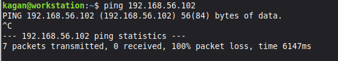
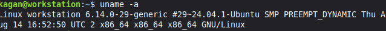
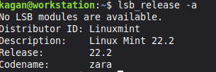
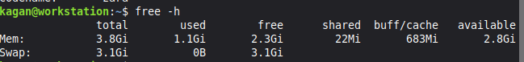
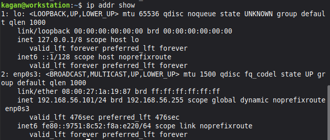

# Operating Systems Coursework
**Student**: Kagan Demirtas
**Student ID**: A00038202

---

## Table of Contents
- [Week 1: System Planning and Distribution Selection](#week-1)
- [Week 2: Security Planning and Testing Methodology](#week-2)
- [Week 3: Application Selection for Performance Testing](#week-3)
- [Week 4: Initial System Configuration & Security Implementation](#week-4)
- [Week 5: Advanced Security and Monitoring Infrastructure](#week-5)
- [Week 6: Performance Evaluation and Analysis](#week-6)
- [Week 7: Security Audit and System Evaluation](#week-7)

---

## Week 1: System Planning and Distribution Selection {#week-1}

### Overview
This week focused on planning the operating system deployment architecture and making justified technical decisions for the Linux server infrastructure.

### 1.1 System Architecture Diagram


**Architecture Explanation**:
- Two virtual machines running in VirtualBox on Windows 11 host
- Connected via VirtualBox Host only Network for isolated, secure communication
- Ubuntu Server runs headless (no GUI) accessible only via SSH
- Linux Mint workstation provides administrative interface with GUI and SSH client
- All server administration performed remotely via command line through SSH

### 1.2 Distribution Selection Justification

#### Server Distribution: Ubuntu Server 24.04 LTS

**Selection Rationale**:

1. **Long Term Support (LTS)**: 
   - 5 years of security updates and patches
   - Suitable for production server environments
   - Predictable release cycle for enterprise planning

2. **Industry Standard**:
   - Widely deployed in cloud infrastructure (AWS, Azure, GCP)
   - Extensive documentation and community support
   - Large knowledge base for troubleshooting

3. **Security Features**:
   - AppArmor mandatory access control enabled by default
   - Regular security updates through Ubuntu Security Team
   - Unattended upgrades for automated security patching

4. **Package Management**:
   - APT package manager with extensive repository
   - Easy installation of security tools (fail2ban, ufw, lynis)
   - Well maintained server optimised packages

5. **Resource Efficiency**:
   - Minimal resource footprint without desktop environment
   - Optimised for server workloads
   - Suitable for headless deployment

**Conclusion**: Ubuntu Server 24.04 LTS provides the optimal balance of stability, security, ease of use, and industry relevance for this coursework.

#### Workstation Distribution: Linux Mint 22 (Cinnamon Edition)

**Selection Rationale**:

1. **Ubuntu Compatibility**:
   - Based on Ubuntu LTS (same package base)
   - Same APT commands work identically
   - Reduces learning curve between systems

2. **User Friendly Desktop Environment**:
   - Intuitive Cinnamon desktop interface
   - Pre configured with essential tools
   - Reduces configuration overhead

3. **Built in Administrative Tools**:
   - Terminal emulator with SSH support
   - System monitoring utilities
   - Text editors for script development

4. **Stability**:
   - Built on Ubuntu LTS foundation
   - Conservative update approach
   - Reliable for coursework duration

5. **Professional Use Case**:
   - Administrators use desktop Linux to manage servers
   - Demonstrates cross distribution competency
   - Realistic system administration workflow

### 1.3 Network Configuration Documentation

#### VirtualBox Network Setup

**Network Type**: Host only Adapter

**Rationale for Host only Network**:
- Provides isolated network environment for security testing
- VMs can communicate with each other and host
- No exposure to external networks (security best practice for learning)
- Consistent IP addressing across sessions
- Allows safe security tool testing (nmap, fail2ban) without ethical concerns

**Network Configuration**:
- **Network Range**: 192.168.56.0/24
- **DHCP Server**: Enabled by VirtualBox
- **Gateway**: 192.168.56.1 (VirtualBox host interface)

**IP Address Allocation**:
- Ubuntu Server: 192.168.56.102
- Linux Mint Workstation: 192.168.56.101

#### Network Verification

**Connectivity Test** (from workstation to server):


Network connectivity is confirmed between workstation and server

Now lets try pinging the server while it is down



The packets did not get recieved. This is proof that there is a connection between the client and the server.

### 1.4 System Specifications (Command Line Evidence)

#### Ubuntu Server Specifications


The `uname -a` command displays kernel and system information:

**Kernel Version**: 6.8.0-90-generic
- Latest stable kernel for Ubuntu 24.04 LTS
- `PREEMPT_DYNAMIC` indicates kernel optimised for responsiveness

**Architecture**: x86_64 (64-bit system)
- Compatible with modern server applications
- Supports large memory addressing


The `lsb_release -a` command shows distribution details:

**Distribution**: Ubuntu 24.04.3 LTS (Noble Numbat)
- Long-Term Support release with 5 years of security updates (until April 2029)
- Codename: Noble
- Latest point release (24.04.3) includes recent security patches and bug fixes


The `free -h` command shows memory usage:

**RAM:**
- Total: 1.9GB (2GB allocated in VirtualBox)
- Used: 338MB (18% utilisation)
- Available: 1.6GB
- Minimal footprint due to headless configuration (no desktop environment)

**Swap:**
- Total: 2.0GB configured
- Used: 0B (no swapping occurring)
- System has sufficient RAM, swap provides safety margin


The `df -h` command shows disk space usage:

- **Root partition**: 12GB total, 4.6GB used (43%)
- **Boot partition**: 2.0GB total, 100MB used (6%)
- System uses LVM (Logical Volume Manager) for flexible storage
- 6.2GB available space is enough


The `ip addr show` command displays network interface information:

**Primary Interface (enp0s3):**
- IP Address: 192.168.56.102/24
- MAC Address: 08:00:27:f3:e3:93
- Status: UP and operational
- DHCP assigned (VirtualBox Host-Only Network)
- This IP will be used for SSH access from the workstation

**Loopback Interface (lo):**
- Standard localhost interface (127.0.0.1)
- Used for internal system communication

#### Linux Mint Workstation Specifications









### 1.5 Key Learning Points - Week 1

**Technical Skills Developed**:
- VirtualBox VM creation and configuration
- Network topology design and implementation
- Linux distribution evaluation and selection
- Basic Linux command line navigation and system information gathering

**Challenges Encountered**:
1. **Network Configuration Complexity**: Initially attempted NAT networking, realised host only adapter better suited for isolated server administration practice
2. **Resource Allocation**: Balanced VM resources to run both simultaneously on host system

**Next Steps**:
- Week 2 will focus on developing security baseline and performance testing methodology
- Begin SSH key based authentication research
- Plan firewall rules and access control policies

###################################################################################################################################################################################################################

## Week 2: Security Planning and Testing Methodology {#week-2}

### Overview
This week focused on developing a security strategy and establishing methodologies for performance testing. The planning defined objectives for implementing security controls in Weeks 4 and 5, and outlined the approach for performance evaluation in Week 6.

### 2.1 Performance Testing Plan

**Testing Objectives:**

The performance testing will establish baseline system metrics, evaluate behaviour under various workloads, identify bottlenecks, and quantify the impact of security controls on system performance.

**Remote Monitoring Methodology:**

Performance testing will be conducted remotely via SSH from the Linux Mint workstation to the Ubuntu Server. This mirrors professional system administration practices where administrators monitor production servers without direct console access. The workstation executes monitoring commands via SSH, the server collects and returns metrics, and data is captured on the workstation with no performance overhead from graphical tools on the server.

**Key Metrics:**

CPU metrics will include usage percentage, load average, and core utilisation using `top`, `mpstat`, and `uptime`. Memory metrics will track used/free RAM, buffer/cache, and swap usage with `free` and `vmstat`. Disk I/O will measure read/write throughput and IOPS using `iostat` and `iotop`. Network monitoring will capture bandwidth utilisation and packet rates with `iftop` and `nethogs`. Process information will include process count and resource consumption via `ps` and `htop`.

**Testing Approach:**

Baseline testing will establish idle system performance by monitoring metrics with no active workloads for 5 minutes. Application load testing will assess the system under realistic workloads by running selected applications for 10 minutes each whilst measuring application-specific resource consumption. Performance analysis will identify bottlenecks through metric correlation, compare performance across applications, and evaluate the impact of security configurations.

### 2.2 Security Implementation Plan

**Week 4 Controls:**

SSH hardening will involve generating ED25519 key pairs, copying the public key to the server, disabling password authentication, disabling root login, and enabling public key authentication. Firewall configuration will install UFW, define default deny policies, allow SSH from the workstation IP only, and verify all rules. User management will create a non-root admin user with sudo privileges whilst implementing the principle of least privilege.

**Week 5 Controls:**

AppArmor mandatory access control will be verified and documented, showing active profiles in enforce mode. Automatic security updates will be configured via the unattended-upgrades package with daily checking enabled. Fail2ban intrusion detection will be installed and configured with an SSH jail, 5 maximum retry attempts, and 600-second ban times.

### 2.3 Threat Model

**Threat 1: Unauthorised SSH Access**

Attackers may attempt to gain SSH access through brute-force password guessing, dictionary attacks, or credential stuffing. This is a high-likelihood threat with critical impact as successful compromise grants full system access.

Mitigations include disabling password authentication entirely to eliminate password guessing attacks, implementing fail2ban to automatically block IPs after failed attempts, restricting SSH via firewall rules to known IP addresses only, and disabling root login to prevent direct root access even if credentials are compromised.

**Threat 2: Unpatched Vulnerabilities**

Attackers may exploit known vulnerabilities in running services due to outdated packages or missing security patches. This medium-likelihood threat has high impact potential including remote code execution and data breaches.

Mitigations include enabling automatic security updates to ensure patches are applied within 24 hours, minimising the attack surface by disabling unnecessary services, conducting regular Lynis security audits to identify weaknesses proactively, and enforcing AppArmor profiles to limit damage scope even if a service is compromised.

**Threat 3: Privilege Escalation**

Legitimate users with limited access may attempt to gain elevated privileges through misconfiguration or vulnerability exploitation. This low-likelihood threat has high impact allowing unauthorised access to sensitive data and system reconfiguration.

Mitigations include implementing the principle of least privilege for all user accounts, enforcing AppArmor mandatory access control to contain compromised processes, conducting regular permission audits to identify SUID binaries and potential escalation vectors, and applying kernel hardening configurations to reduce exploit success rates.

### 2.4 Preparation for Implementation

Research was completed on SSH hardening best practices, Linux firewall configuration, mandatory access control systems, and automated patch management strategies. This planning establishes the foundation for Week 4 and 5 implementation whilst ensuring all security controls align with identified threats.

**Next Steps:**
- Week 3: Select applications for performance testing
- Week 4: Implement SSH hardening and firewall configuration
- Week 5: Deploy advanced security controls (AppArmor, fail2ban, automatic updates)

#################################################################################################################################################################################################################################################

## WEEK 3: APPLICATION SELECTION FOR PERFORMANCE TESTING  {#week-2}

### Overview
This week focused on selecting appropriate applications for comprehensive performance evaluation in Week 6. The selection prioritised applications representing diverse workload types to thoroughly assess system behaviour under various resource utilisation patterns.

### 3.1 Selection Criteria

Applications were selected based on their ability to represent different resource utilisation patterns (CPU, RAM, disk I/O, network), generate measurable and repeatable workloads, availability in Ubuntu repositories for easy installation, comprehensive documentation, and suitability for headless server environments.

### 3.2 Selected Applications

**Application 1: stress-ng (CPU-Intensive Workload)**

stress-ng is a CPU stress testing and performance benchmarking tool that generates controllable CPU load across specified cores. It supports various CPU stress methods including arithmetic operations and matrix calculations, provides precise control over test duration and intensity, and is widely used in industry for CPU performance validation.

The application generates 90-100% CPU usage during stress tests whilst maintaining low memory usage (under 50MB) and minimal disk I/O. It will be monitored using `top`, `mpstat`, and load average metrics during test execution.

Installation: `sudo apt install stress-ng -y`

Usage example: `stress-ng --cpu 2 --timeout 60s`

**Application 2: nginx (Server Application - Balanced Workload)**

nginx is an industry-standard web server that generates realistic server workloads combining CPU, memory, and network utilisation. It demonstrates typical server application resource usage and is suitable for testing concurrent connection handling, matching real-world production scenarios.

The application generates moderate CPU usage (20-40% under load), low to moderate memory consumption (100-200MB), low disk I/O for static file serving, and moderate to high network usage depending on request rates. Monitoring will track combined resource usage with `htop`, network connections with `ss`, and response times.

Installation: `sudo apt install nginx -y`

Usage: Service runs continuously after installation and startup

**Application 3: fio (I/O-Intensive Workload)**

fio is a flexible I/O workload generator supporting various access patterns with precise control over read/write ratios, block sizes, and queue depths. It generates detailed I/O performance statistics and is the standard tool for storage performance evaluation in enterprise environments.

The application produces very high disk I/O that saturates disk bandwidth whilst maintaining low to moderate CPU usage (10-30%) and low memory consumption (under 100MB). Monitoring will use `iostat -x 1` to track disk utilisation, await times, and throughput during tests.

Installation: `sudo apt install fio -y`

Usage example: `fio --name=test --size=1G --rw=randwrite --bs=4k --runtime=60`

**Application 4: iperf3 (Network-Intensive Workload)**

iperf3 is the standard tool for network performance measurement, testing TCP and UDP throughput between systems whilst providing detailed network performance metrics. It validates network configuration and measures maximum achievable bandwidth.

The application saturates network bandwidth whilst maintaining low to moderate CPU usage (5-20%) and minimal memory consumption (under 50MB) with no disk I/O. Network throughput will be monitored with `iftop`, packet rates with `nethogs`, and CPU impact will be observed.

Installation: `sudo apt install iperf3 -y`

Usage: Run server mode on Ubuntu Server (`iperf3 -s`) and client mode from workstation (`iperf3 -c 192.168.56.102`)

**Application 5: htop (System Monitoring Tool)**

htop is an interactive process viewer providing real-time system resource monitoring with colour-coded output for easy interpretation. It shows per-core CPU usage, memory breakdown, and process trees, making it essential for understanding overall system behaviour during performance tests.

The monitoring tool has minimal resource overhead with under 2% CPU usage and very low memory consumption (under 20MB), ensuring it doesn't impact the tests it's monitoring. It will run continuously during other application tests to observe real-time resource consumption.

Installation: `sudo apt install htop -y`

Usage: Run interactively with `htop` command

### 3.3 Testing Strategy

**Phase 1: Baseline Measurements**

Baseline measurements will establish idle system performance by monitoring CPU, memory, disk, and network metrics for 5 minutes with no applications running.

**Phase 2: Individual Application Testing**

Each application will be tested independently for 5-10 minutes whilst monitoring resource consumption with htop and specialised tools. Peak and average resource usage will be recorded for each application

**Phase 3: Combined Workload Testing**

Multiple applications will run simultaneously to observe resource contention and system behaviour under mixed loads. This will identify performance degradation thresholds when the system is under realistic combined workloads

**Phase 4: Analysis and Documentation**

Results will be analysed to identify system bottlenecks, understand workload characteristics, evaluate security control performance impact, and develop recommendations for system optimisation

### 3.4 Expected Outcomes

The testing will produce quantitative data including CPU utilisation percentages, memory consumption metrics, disk I/O throughput measurements, network bandwidth utilisation, and process statistics. Qualitative analysis will identify system bottlenecks, characterise workload behaviour, assess security control performance impacts, and generate optimisation recommendations.

### 3.5 Installation Documentation

All applications were installed during Week 5 setup via SSH using the APT package manager. The installation included stress-ng, nginx, fio, iperf3, and htop, along with additional monitoring tools including iotop for I/O monitoring by process, iftop for real-time network bandwidth monitoring, nethogs for network usage per process, and sysstat for performance monitoring tools including iostat and mpstat.

Installation command used:
```bash
sudo apt update
sudo apt install stress-ng nginx fio iperf3 htop iotop iftop nethogs sysstat -y
```

### 3.6 Preparation for Week 6

All applications have been identified with clear justifications, installation procedures are documented, monitoring strategies are established, and the testing methodology is designed. This preparation ensures Week 6 performance testing can proceed efficiently with consistent and reliable measurements.
