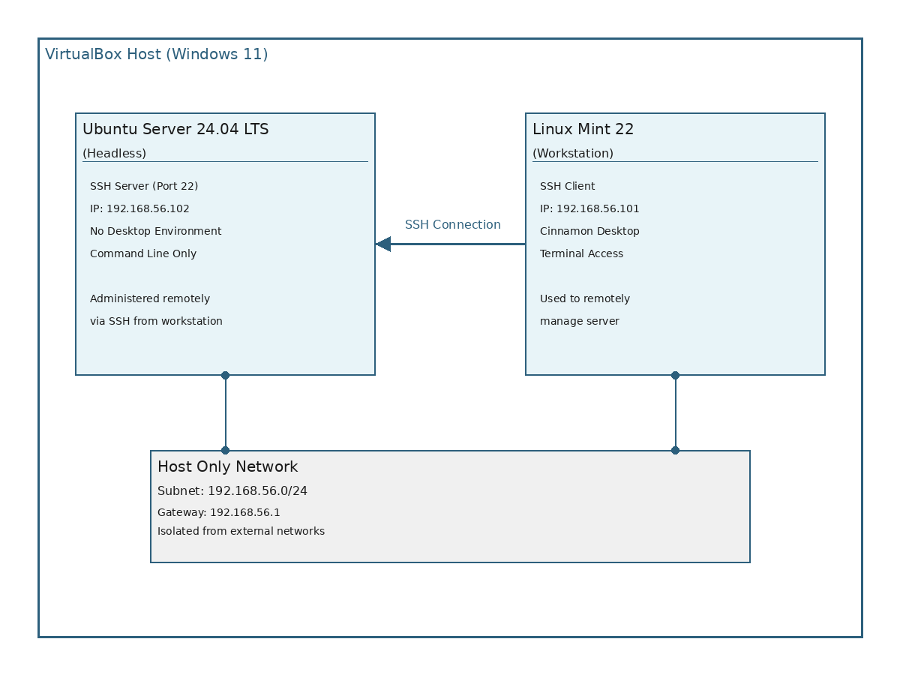
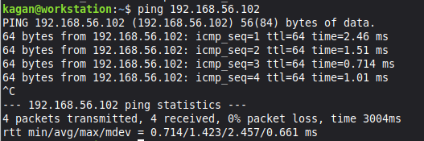
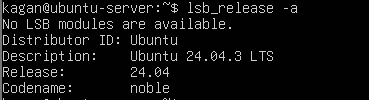
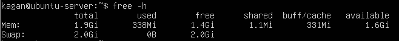
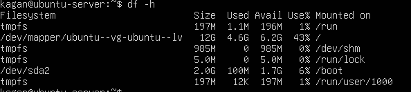
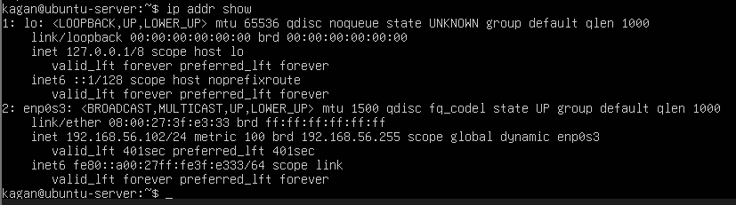

# Operating Systems Coursework
**Student**: Kagan Demirtas
**Student ID**: A00038202

---

## Table of Contents
- [Week 1: System Planning and Distribution Selection](#week-1)
- [Week 2: Security Planning and Testing Methodology](#week-2)
- [Week 3: Application Selection for Performance Testing](#week-3)
- [Week 4: Initial System Configuration & Security Implementation](#week-4)
- [Week 5: Advanced Security and Monitoring Infrastructure](#week-5)
- [Week 6: Performance Evaluation and Analysis](#week-6)
- [Week 7: Security Audit and System Evaluation](#week-7)

---

## Week 1: System Planning and Distribution Selection {#week-1}

### Overview
This week focused on planning the operating system deployment architecture and making justified technical decisions for the Linux server infrastructure.

### 1.1 System Architecture Diagram



**Architecture Explanation**:
- Two virtual machines running in VirtualBox on Windows 11 host
- Connected via VirtualBox Host only Network for isolated, secure communication
- Ubuntu Server runs headless (no GUI) accessible only via SSH
- Linux Mint workstation provides administrative interface with GUI and SSH client
- All server administration performed remotely via command line through SSH

### 1.2 Distribution Selection Justification

#### Server Distribution: Ubuntu Server 24.04 LTS

**Selection Rationale**:

1. **Long Term Support (LTS)**: 
   - 5 years of security updates and patches
   - Suitable for production server environments
   - Predictable release cycle for enterprise planning

2. **Industry Standard**:
   - Widely deployed in cloud infrastructure (AWS, Azure, GCP)
   - Extensive documentation and community support
   - Large knowledge base for troubleshooting

3. **Security Features**:
   - AppArmor mandatory access control enabled by default
   - Regular security updates through Ubuntu Security Team
   - Unattended upgrades for automated security patching

4. **Package Management**:
   - APT package manager with extensive repository
   - Easy installation of security tools (fail2ban, ufw, lynis)
   - Well maintained server optimised packages

5. **Resource Efficiency**:
   - Minimal resource footprint without desktop environment
   - Optimised for server workloads
   - Suitable for headless deployment

**Conclusion**: Ubuntu Server 24.04 LTS provides the optimal balance of stability, security, ease of use, and industry relevance for this coursework.

#### Workstation Distribution: Linux Mint 22 (Cinnamon Edition)

**Selection Rationale**:

1. **Ubuntu Compatibility**:
   - Based on Ubuntu LTS (same package base)
   - Same APT commands work identically
   - Reduces learning curve between systems

2. **User Friendly Desktop Environment**:
   - Intuitive Cinnamon desktop interface
   - Pre configured with essential tools
   - Reduces configuration overhead

3. **Built in Administrative Tools**:
   - Terminal emulator with SSH support
   - System monitoring utilities
   - Text editors for script development

4. **Stability**:
   - Built on Ubuntu LTS foundation
   - Conservative update approach
   - Reliable for coursework duration

5. **Professional Use Case**:
   - Administrators use desktop Linux to manage servers
   - Demonstrates cross distribution competency
   - Realistic system administration workflow

### 1.3 Network Configuration Documentation

#### VirtualBox Network Setup

**Network Type**: Host only Adapter

**Rationale for Host only Network**:
- Provides isolated network environment for security testing
- VMs can communicate with each other and host
- No exposure to external networks (security best practice for learning)
- Consistent IP addressing across sessions
- Allows safe security tool testing (nmap, fail2ban) without ethical concerns

**Network Configuration**:
- **Network Range**: 192.168.56.0/24
- **DHCP Server**: Enabled by VirtualBox
- **Gateway**: 192.168.56.1 (VirtualBox host interface)

**IP Address Allocation**:
- Ubuntu Server: 192.168.56.102
- Linux Mint Workstation: 192.168.56.101

#### Network Verification

**Connectivity Test** (from workstation to server):



✓ Network connectivity confirmed between workstation and server

### 1.4 System Specifications (Command Line Evidence)

#### Ubuntu Server Specifications


- **Kernel**: 6.8.0-90-generic
- **Architecture**: x86_64 (64-bit)
- **Kernel Type**: Preemptible dynamic (optimised for responsiveness)



- **Distribution**: Ubuntu 24.04.3 LTS (Noble Numbat)
- **Support Period**: Until April 2029



- **Total RAM**: 2GB (allocated in VirtualBox)
- **Used Memory**: 338MB (minimal headless use)
- **Available Memory**: 1.6GB (more than enough for server use)
- **Swap**: 2GB (configured during installation)



- **Root partition**: 12GB total, 4.6GB used (43%)
- **Boot partition**: 2.0GB total, 100MB used (6%)
- System uses LVM (Logical Volume Manager) for flexible storage
- 6.2GB available space is enough



The `ip addr show` command displays network interface information:

**Primary Interface (enp0s3):**
- IP Address: 192.168.56.102/24
- MAC Address: 08:00:27:f3:e3:93
- Status: UP and operational
- DHCP assigned (VirtualBox Host-Only Network)
- This IP will be used for SSH access from the workstation

**Loopback Interface (lo):**
- Standard localhost interface (127.0.0.1)
- Used for internal system communication

#### Linux Mint Workstation Specifications

**Screenshot**: [Workstation terminal showing system info]


```bash
kagan@workstation:~$ uname -a
Linux workstation 6.8.0-48-generic #48-Ubuntu SMP PREEMPT_DYNAMIC Fri Sep 27 14:04:36 UTC 2024 x86_64 x86_64 x86_64 GNU/Linux
```

```bash
kagan@workstation:~$ lsb_release -a
No LSB modules are available.
Distributor ID: Linuxmint
Description:    Linux Mint 22 Wilma
Release:        22
Codename:       wilma
```

```bash
kagan@workstation:~$ free -h
               total        used        free      shared  buff/cache   available
Mem:           3.8Gi       892Mi       2.1Gi       45Mi       867Mi       2.7Gi
Swap:          2.0Gi          0B       2.0Gi
```

```bash
kagan@workstation:~$ ip addr show enp0s3
2: enp0s3: <BROADCAST,MULTICAST,UP,LOWER_UP> mtu 1500 qdisc fq_codel state UP group default qlen 1000
    link/ether 08:00:27:yy:yy:yy brd ff:ff:ff:ff:ff:ff
    inet 192.168.56.102/24 brd 192.168.56.255 scope global dynamic noprefixroute enp0s3
       valid_lft 571sec preferred_lft 571sec
```

### 1.5 Key Learning Points - Week 1

**Technical Skills Developed**:
- VirtualBox VM creation and configuration
- Network topology design and implementation
- Linux distribution evaluation and selection
- Basic Linux command line navigation and system information gathering

**Challenges Encountered**:
1. **Network Configuration Complexity**: Initially attempted NAT networking, realised host only adapter better suited for isolated server administration practice
2. **Resource Allocation**: Balanced VM resources to run both simultaneously on host system

**Next Steps**:
- Week 2 will focus on developing security baseline and performance testing methodology
- Begin SSH key based authentication research
- Plan firewall rules and access control policies

---
