## WEEK 4: INITIAL SYSTEM CONFIGURATION AND SECURITY IMPLEMENTATION {#week-4}

### Overview
Week 4 focused on implementing core security controls. This included SSH hardening through key-based authentication, firewall configuration, and user privilege management. All configurations were implemented remotely via SSH from the Linux Mint workstation.

### 4.1 SSH Key Generation and Configuration

**Objective:** Replace password-based SSH authentication with key-based authentication.

#### SSH Key Pair Generation

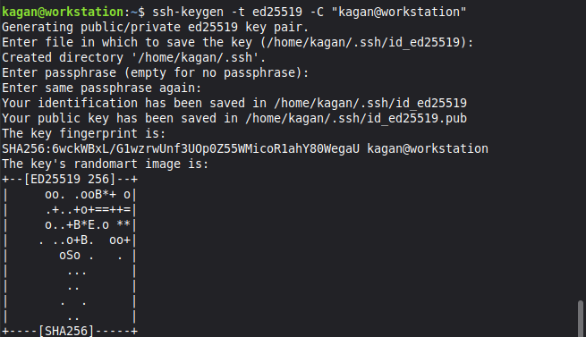

SSH keys were generated on the Linux Mint workstation using the ED25519 algorithm. The command `ssh-keygen -t ed25519 -C "kagan@workstation"` generated a public/private key pair.

**Key Generation Details:**
- Private key: `/home/kagan/.ssh/id_ed25519`
- Public key: `/home/kagan/.ssh/id_ed25519.pub`
- No passphrase configured
- Key fingerprint: SHA256:GwckWBxL/GlwzrWUnf3U0pQZ55wM1coR1ahY80WmegaU

ED25519 was selected over RSA because it offers equivalent security with shorter keys. This results in faster authentication and reduced memory usage.

#### Public Key Verification

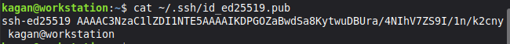

The public key was verified using `cat ~/.ssh/id_ed25519.pub`. This displays the complete public key string beginning with `ssh-ed25519`. The public key will be copied to the server to enable authentication.

#### SSH Key Distribution

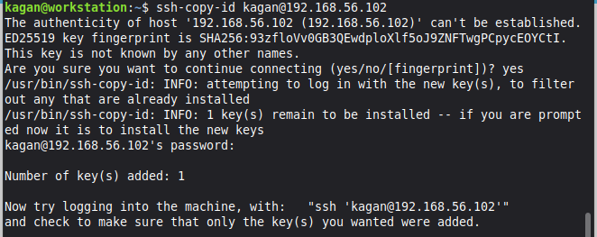

The public key was transferred to the Ubuntu Server using `ssh-copy-id kagan@192.168.56.102`. This utility automatically appends the public key to the remote authorized_keys file. The tool confirmed that 1 key was added successfully.

#### SSH Connection Verification

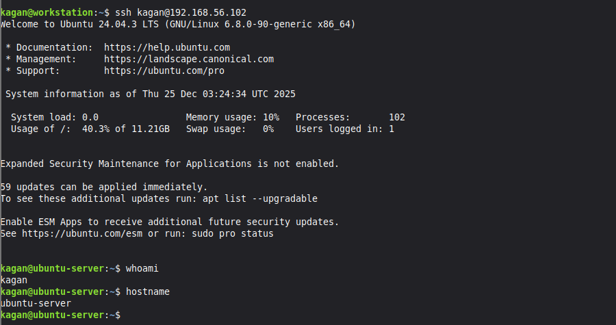

SSH connection was tested using `ssh kagan@192.168.56.102`. The connection was established successfully without password prompt. This confirms key-based authentication is functional.

**System Status:**
- Authentication: Public key (ED25519)
- System load: 0.0 (idle)
- Memory usage: 10%
- Disk usage: 40.3%

### 4.2 SSH Server Hardening

**Objective:** Disable insecure authentication methods and restrict SSH access.

#### Pre-Configuration Analysis

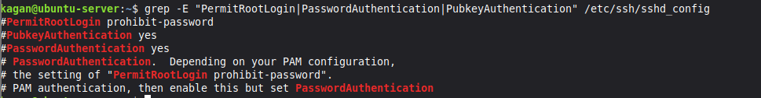

Current settings were documented using `grep` to extract security parameters from `/etc/ssh/sshd_config`:

**Initial Configuration:**
- `PermitRootLogin prohibit-password`: Root can login with keys
- `PubkeyAuthentication yes`: Enabled (commented, using default)
- `PasswordAuthentication yes`: Enabled (commented, using default)

The commented lines indicate default values are in effect. Password authentication is enabled, which allows brute force attacks.

#### Configuration Modification

The SSH configuration file was edited using `sudo nano /etc/ssh/sshd_config`:

**Changes Made:**
1. `PermitRootLogin no`: Completely disables root login
2. `PubkeyAuthentication yes`: Explicitly enables public key authentication
3. `PasswordAuthentication no`: Disables password authentication

These changes enforce key-based authentication exclusively. This eliminates password guessing attacks completely.

#### Post-Configuration Verification

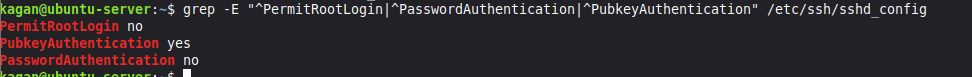

Configuration was verified using the same `grep` command:

**Updated Configuration:**
- `PermitRootLogin no`: Root login disabled
- `PubkeyAuthentication yes`: Public key authentication enabled
- `PasswordAuthentication no`: Password authentication disabled

All three security parameters are now uncommented and set to secure values.

#### SSH Service Restart

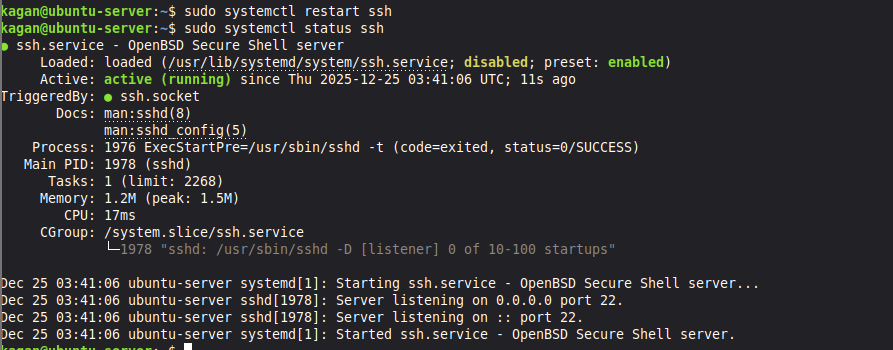

The SSH service was restarted using `sudo systemctl restart ssh`. Status was verified with `sudo systemctl status ssh`.

**Service Status:**
- Status: Active (running)
- Process ID: 1976
- Memory usage: 1.2M
- No errors reported

The service successfully restarted. The existing SSH session remained connected.

### 4.3 Firewall Configuration

**Objective:** Restrict SSH access to the workstation IP address only.

#### Initial Firewall State


Firewall status was checked using `sudo ufw status verbose`. Output showed `Status: inactive`. No firewall rules were being enforced.

#### Firewall Rule Creation

The firewall was configured to allow SSH from the workstation only:
```bash
sudo ufw allow from 192.168.56.101 to any port 22
```

This rule:
- Permits TCP from 192.168.56.101
- To port 22 (SSH)
- Denies all other SSH attempts

#### Firewall Activation

The firewall was enabled using `sudo ufw enable`. UFW warned about potential SSH disruption. After confirming, the firewall became active.

#### Firewall Verification (Numbered)

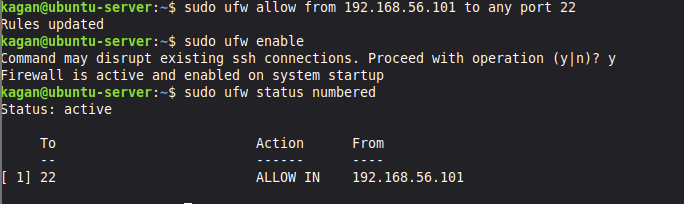

Rules were verified using `sudo ufw status numbered`:

**Active Rules:**
```
[1] 22    ALLOW IN    192.168.56.101
```

Rule 1 allows SSH from the workstation IP only.

#### Firewall Verification (Verbose)

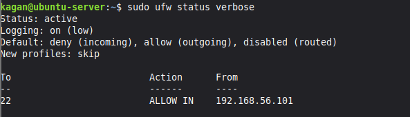

Detailed status checked with `sudo ufw status verbose`:

**Policy Summary:**
- Status: active
- Logging: on (low)
- Default incoming: deny
- Default outgoing: allow

**Active Rule:**
- Port: 22
- Action: ALLOW IN
- From: 192.168.56.101

The default policies deny all incoming traffic except explicitly allowed services. SSH is restricted to the workstation IP address.

### 4.4 User Privilege Management

**Objective:** Create a non-root administrative user with sudo privileges.

#### Administrative User Creation

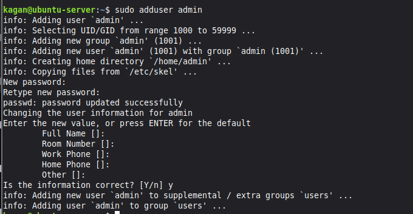

A new user was created using `sudo adduser admin`:

**User Details:**
- Username: admin
- UID: 1001
- GID: 1001
- Home directory: `/home/admin`
- Password: Set

The command automatically created the home directory and copied default configuration files.

#### Sudo Privileges Assignment


The admin user was added to the sudo group using `sudo usermod -aG sudo admin`. Group membership was verified with `groups admin`:

**Admin Groups:**
- admin (primary)
- sudo (grants privileges)
- users

Membership in the sudo group grants administrative privileges.

#### Sudo Access Verification

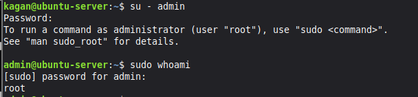

Sudo was tested by switching to admin (`su - admin`) and running `sudo whoami`. The command returned `root`, confirming:

1. Admin user can authenticate with sudo
2. Sudo elevates privileges correctly
3. Commands execute as root

### 4.5 Final Verification

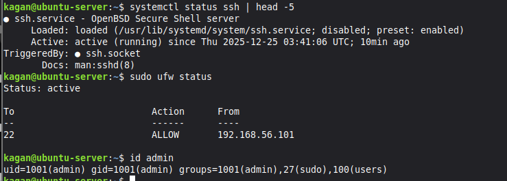

All configurations were verified:

**SSH Service:**
```
Active: active (running)
```

SSH is operational with security changes applied.

**Firewall:**
```
22    ALLOW    192.168.56.101
```

UFW is active with SSH restricted to workstation.

**Admin User:**
```
uid=1001(admin) groups=1001(admin),27(sudo),100(users)
```

Admin user exists with correct privileges.

### 4.6 Security Summary

**Implemented Controls:**

**SSH Hardening:**
- Key-based authentication implemented
- Password authentication disabled
- Root login disabled

**Network Security:**
- UFW firewall enabled
- Default deny policy active
- SSH restricted to workstation IP

**Access Control:**
- Non-root admin user created
- Sudo privileges assigned
- Principle of least privilege applied

### 4.7 Key Learning Points

**SSH Security:**
- Public key cryptography implementation
- ED25519 algorithm advantages
- SSH configuration parameters
- Authentication testing procedures

**Firewall Management:**
- UFW syntax and rule creation
- Default policy configuration
- Source-based access control
- Rule verification methods

**User Management:**
- Linux user creation procedures
- Group-based privileges
- Sudo configuration
- Access verification

### 4.8 Challenges Encountered

**SSH Configuration Testing:**

Concern about server lockout after disabling passwords.

**Solution:** Verified key authentication worked before modifying config. Kept existing session open whilst testing new connection.

**Firewall Rule Ordering:**

Understanding UFW rule processing.

**Solution:** Created allow rule before enabling firewall. Verified rule was active before activation.

### 4.9 Critical Reflections

**SSH Key Selection:**

ED25519 provides equivalent security to 3072-bit RSA with only 256-bit keys. This results in faster authentication and better performance. For production environments, ED25519 is increasingly recommended.

**Firewall Scope:**

The firewall restricts SSH to a single IP address. In production, this might be too restrictive. A more scalable approach would use IP ranges or VPN access. For this coursework, the specific IP restriction demonstrates granular access control.

**Privilege Management:**

The separate admin user follows security best practices. This enables accountability, selective privilege elevation, and easier revocation. However, the admin user has full sudo access. Production environments would use more granular sudo rules.

**Security vs Usability:**

Disabling passwords completely eliminates brute force attacks. However, lost private keys result in complete access loss. Production environments often retain passwords with fail2ban protection. Complete disablement maximises security for this coursework.

### 4.10 Next Steps

Week 5 will implement advanced security controls:

**Planned Controls:**
- AppArmor mandatory access control
- Automatic security updates
- Fail2ban intrusion detection
- Security monitoring scripts

The SSH, firewall, and user management configurations provide the secure foundation for Week 5 security layers.
