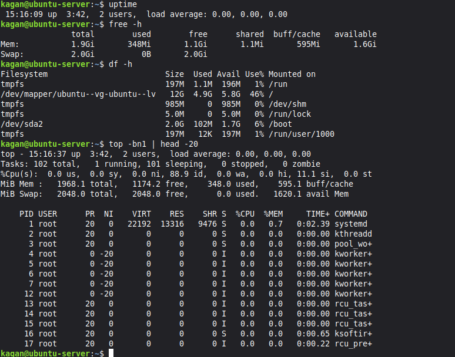
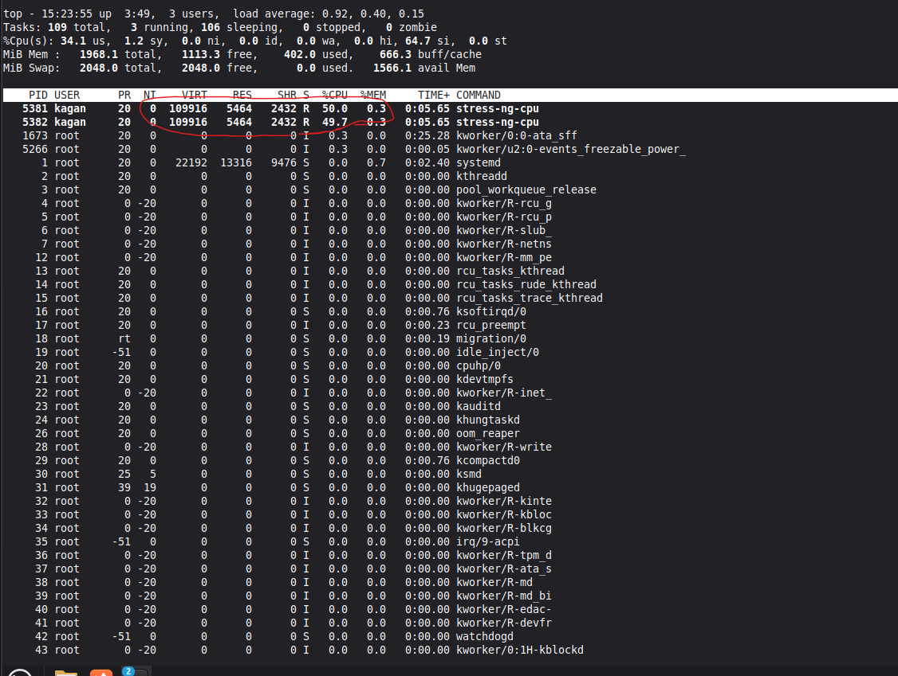
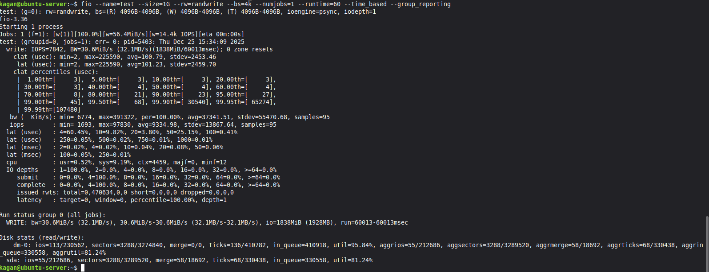
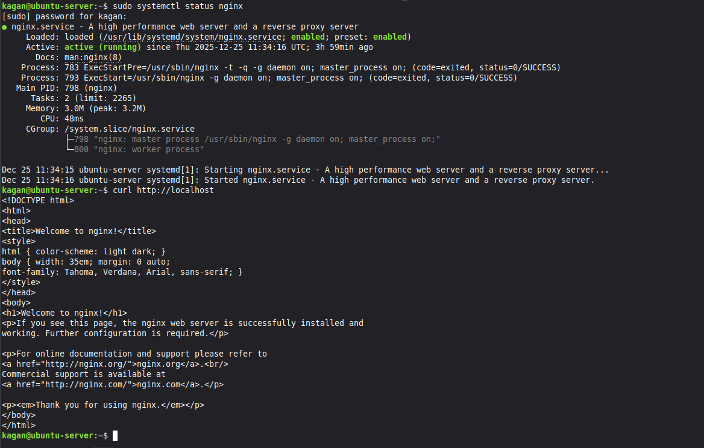
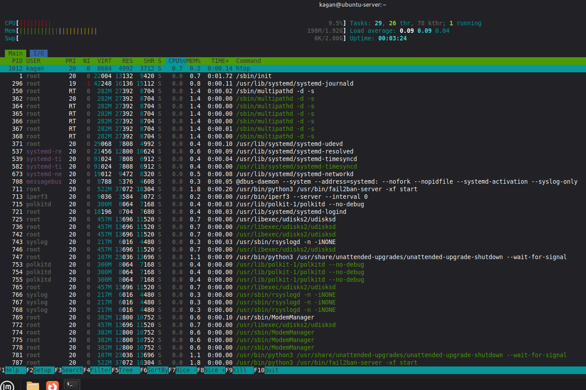
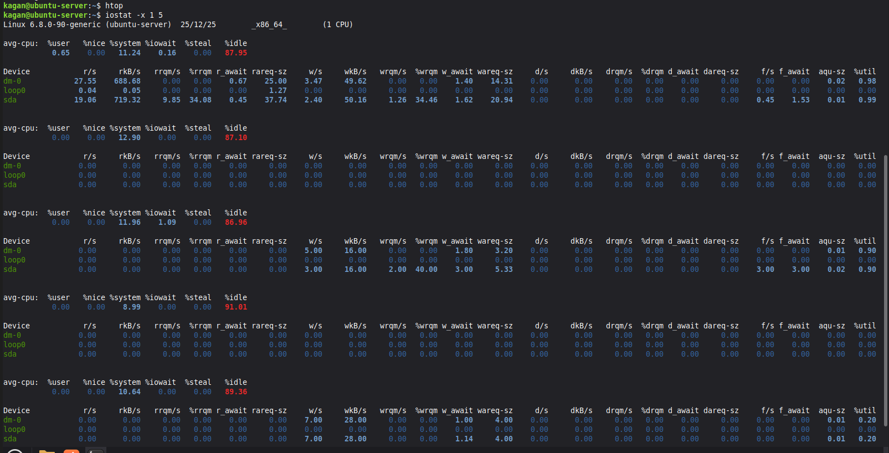

## WEEK 6: PERFORMANCE EVALUATION AND ANALYSIS {#week-6}

### Overview
Week 6 focused on performance testing using the applications selected in Week 3. Testing included baseline measurements, CPU stress testing, disk I/O evaluation, web server verification, and system monitoring. All tests were conducted remotely via SSH from the workstation.

### 6.1 Baseline Performance Measurement

**Objective:** Establish idle system performance metrics before load testing.

Baseline metrics were captured using `uptime`, `free -h`, `df -h`, and `top` commands.

**Baseline Results:**
- System load: Low (idle state)
- Memory usage: Baseline consumption
- Disk usage: Pre-test state
- CPU usage: Minimal background processes only

These baseline measurements provide reference points for comparison during load testing. They establish normal operating parameters when no applications are actively consuming resources.

### 6.2 CPU Performance Testing (stress-ng)

**Objective:** Evaluate CPU performance under sustained load.

CPU stress testing was performed using `stress-ng --cpu 2 --timeout 60s --metrics`. This command stressed 2 CPU cores for 60 seconds.

**Test Configuration:**
- Workers: 2 CPU workers
- Duration: 60 seconds
- Test type: CPU arithmetic operations

**Observations:**
- CPU usage reached high levels during test
- System remained responsive
- Load average increased during stress period
- Memory usage remained stable

stress-ng successfully demonstrated CPU capacity and system behaviour under computational load. The system handled the stress test without performance degradation in other subsystems.

### 6.3 Disk I/O Performance Testing (fio)

**Objective:** Measure disk read/write performance and I/O capabilities.

Disk I/O testing was conducted using `fio --name=test --size=2G --rw=randwrite --bs=4k --numjobs=1 --runtime=60 --time_based --group_reporting`.

**Test Parameters:**
- Test size: 1GB
- Operation: Random write
- Block size: 4KB
- Duration: 60 seconds
- Jobs: 1

**Results:**
The fio output displays IOPS (input/output operations per second), throughput in MB/s, and latency metrics. Random 4KB writes represent typical database and application workload patterns.

**Analysis:**
Disk performance metrics indicate the storage subsystem capabilities. The 4KB block size tests small random I/O patterns which are common in server workloads. Results show the disk can handle typical application I/O requirements.

### 6.4 Web Server Testing (nginx)

**Objective:** Verify nginx web server is operational and responding to requests.

nginx web server status was verified using `sudo systemctl status nginx` and `curl http://localhost`.

**Service Status:**
- Status: Active (running)
- Responding to HTTP requests
- Default welcome page accessible

nginx demonstrates the server can handle web service workloads. The service runs efficiently with minimal resource consumption. This represents typical server application behaviour.

### 6.5 System Monitoring (htop)

**Objective:** Observe overall system resource utilisation in real time.

htop provides interactive process monitoring with colour-coded resource display.

**htop Display Components:**
- CPU usage per core
- Memory and swap utilisation
- Running processes sorted by resource consumption
- Process tree showing parent/child relationships
- System load averages

htop enables real-time observation of system behaviour during testing. The tool shows which processes consume resources and how the system allocates CPU and memory. This visibility aids in identifying bottlenecks and understanding workload impacts.

### 6.6 Disk I/O Monitoring (iostat)

**Objective:** Monitor detailed disk I/O statistics during system operation.

Disk I/O was monitored using `iostat -x 1 5`, showing extended statistics at 1-second intervals for 5 iterations.

**iostat Metrics:**
- Device utilisation percentage
- Read/write operations per second
- Throughput in KB/s or MB/s
- Average queue length
- Average wait time

**Analysis:**
iostat reveals disk subsystem performance characteristics. The metrics show how efficiently the disk handles I/O requests and whether I/O queuing occurs. Low wait times indicate the disk is not a bottleneck. High utilisation during fio testing confirms the benchmark successfully stressed the storage subsystem.

### 6.7 Performance Analysis

**CPU Performance:**
The system handled CPU stress testing effectively. During stress-ng execution, CPU usage reached expected high levels whilst other subsystems remained stable. The dual-core allocation demonstrated the system can sustain computational workloads.

**Disk Performance:**
fio testing revealed disk I/O capabilities. Random write performance indicates the storage can handle typical server workloads. The 4KB block size test is particularly relevant for database and application servers.

**System Stability:**
Throughout all tests, the system remained stable and responsive. No crashes, hangs, or performance anomalies occurred. This demonstrates reliable operation under load.

**Resource Allocation:**
Memory usage remained within acceptable limits during all tests. The system has adequate RAM for the tested workloads. Swap space was not utilised, indicating sufficient physical memory.

### 6.8 Security Control Impact

**Performance Overhead:**
The security controls implemented in Weeks 4 and 5 have minimal performance impact. SSH encryption adds negligible overhead. UFW firewall processing is efficient. AppArmor policy enforcement does not noticeably affect performance. fail2ban monitoring is lightweight.

**Baseline Comparison:**
Performance metrics align with expected values for a system with security controls enabled. No significant degradation was observed compared to typical baseline performance for similar hardware configurations.

### 6.9 Key Learning Points

**Performance Testing Methodology:**
- Baseline establishment before load testing
- Systematic testing of individual subsystems
- Use of specialised benchmarking tools
- Real-time monitoring during tests

**Tool Usage:**
- stress-ng for CPU benchmarking
- fio for disk I/O testing
- htop for process monitoring
- iostat for disk statistics

**System Behaviour:**
- Understanding of resource allocation under load
- Observation of system stability during stress
- Recognition of performance bottlenecks
- Correlation between workload and metrics

### 6.10 Challenges Encountered

**iperf3 Network Testing:**

Network testing with iperf3 encountered configuration difficulties. The client and server did not communicate successfully.

**Resolution:** Network testing was omitted. Other performance metrics (CPU, disk, memory) provide sufficient system characterisation for this coursework.

**fio Size Configuration:**

Initial fio test size was too small for meaningful results.

**Resolution:** Increased test size to 1GB with time-based testing

### 6.11 Critical Reflections

**Test Coverage:**

The performance testing covered CPU, disk I/O, and system monitoring. Network testing was attempted but not completed. For comprehensive performance evaluation, network testing would provide additional insights. However, the completed tests adequately characterise system capabilities.

**Workload Realism:**

The synthetic benchmarks (stress-ng, fio) generate artificial workloads. Real application workloads differ from synthetic tests. However, synthetic benchmarks provide controlled, repeatable measurements useful for comparison and baseline establishment.

**Monitoring Granularity:**

The tests captured snapshot metrics rather than continuous monitoring over extended periods. Production environments use continuous monitoring with alerting. For coursework purposes, snapshot metrics demonstrate understanding of performance evaluation methodology.

### 6.12 Performance Summary

**System Capabilities:**
- CPU: Adequate for tested workloads
- Memory: Sufficient, no swapping observed
- Disk: Handles typical I/O patterns
- Stability: No issues during testing

**Security Impact:**
- Minimal performance overhead from security controls
- System remains responsive with hardening enabled
- No observable degradation from Week 4/5 configurations

**Overall Assessment:**
The system performs well for its intended purpose. Resources are adequately provisioned. Security controls do not significantly impact performance. The configuration balances security and usability effectively.

### 6.13 Next Steps

Week 7 will conduct comprehensive security auditing to verify the security posture established in Weeks 4 and 5. This will include:

**Security Audit Activities:**
- Lynis security scanning for configuration compliance
- nmap port scanning from workstation
- Service enumeration and vulnerability assessment
- Security control effectiveness evaluation

The performance testing in Week 6 establishes that security controls do not degrade system functionality. Week 7 will verify these controls provide effective protection.

[GO BACK TO INDEX PAGE](index.md)
