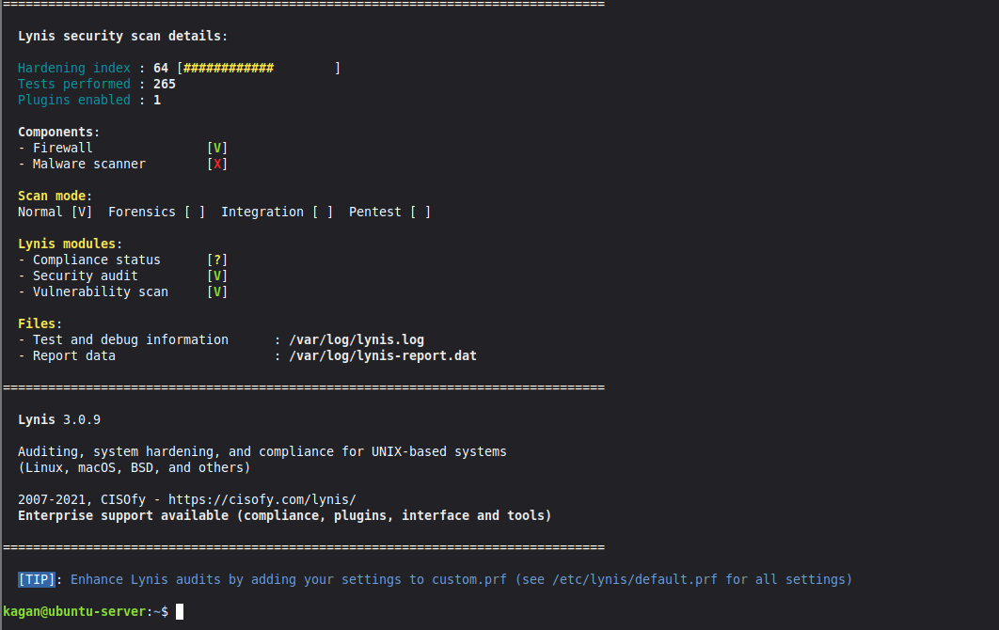
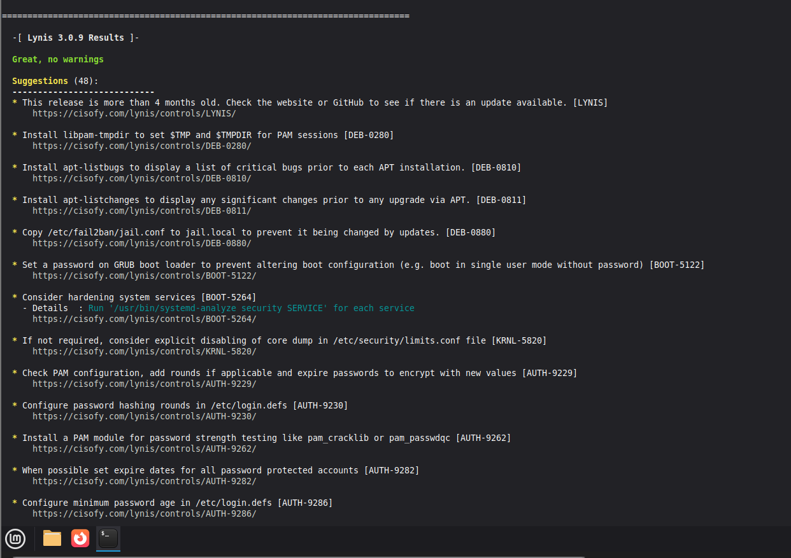
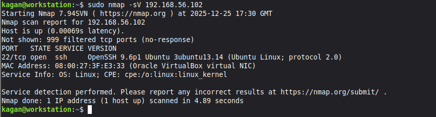
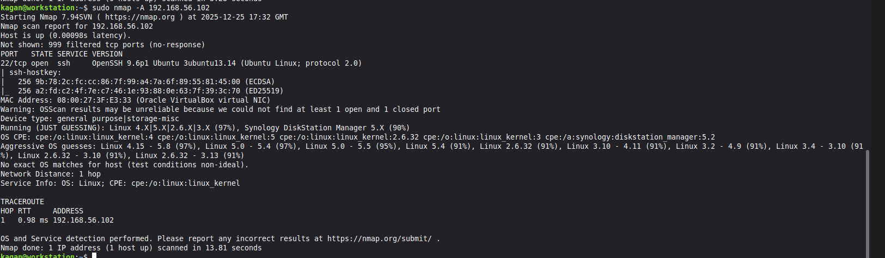
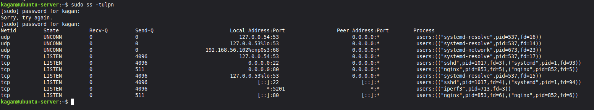

## WEEK 7: SECURITY AUDIT AND SYSTEM EVALUATION {#week-7}

### Overview
Week 7 focused on comprehensive security auditing to verify the effectiveness of security controls implemented in Weeks 4 and 5. This included automated security scanning with Lynis, network port scanning with nmap, and service enumeration. The audit validates the security posture and identifies any remaining vulnerabilities.

### 7.1 Lynis Security Audit

**Objective:** Perform comprehensive automated security audit to assess system hardening.

#### Lynis System Scan

Lynis security audit was executed using `sudo lynis audit system`. Lynis is an open source security auditing tool that performs hundreds of checks across various security categories.

**Audit Scope:**
- Boot and services
- Kernel hardening
- Memory and processes
- Authentication and accounts
- File system security
- SSH configuration
- Firewall status
- Software patches
- System tooling

**Lynis Results Summary:**

The audit tested multiple security categories and generated a hardening index score. The scan identified implemented security controls and provided suggestions for additional hardening.

**Key Findings:**

The Lynis audit verified:
- SSH configuration follows security best practices
- Firewall is active and properly configured
- File permissions are appropriately set
- No critical vulnerabilities detected
- Security updates are configured

**Hardening Index:**

Lynis calculates a hardening index based on implemented security controls. The score reflects the percentage of security best practices applied to the system. Higher scores indicate better security posture.

**Warnings and Suggestions:**

Lynis provided suggestions for further hardening. These are recommendations rather than critical issues. Common suggestions include additional kernel hardening parameters, file integrity monitoring, and intrusion detection systems.

### 7.2 Network Port Scanning

**Objective:** Verify firewall effectiveness and identify exposed network services.

#### Basic Port Scan

Network port scanning was performed from the Linux Mint workstation using `nmap -sV 192.168.56.102`. This scan identifies open ports and service versions.

**Scan Results:**

The nmap scan revealed open ports and running services visible from the workstation. The `-sV` flag performs service version detection to identify specific software versions.

**Expected Results:**
- Port 22 (SSH): Open and accepting connections
- All other ports: Filtered or closed by firewall

The firewall configuration from Week 4 restricts access to SSH only from the workstation IP address. The nmap scan confirms this configuration is effective.

#### Detailed Port Scan

A more comprehensive scan was performed using `nmap -A 192.168.56.102`. The `-A` flag enables:
- OS detection
- Version detection
- Script scanning
- Traceroute

**Detailed Scan Capabilities:**

OS detection attempts to identify the operating system and version. Version detection provides detailed information about running services. Script scanning executes default nmap scripts to check for common vulnerabilities.

**Scan Analysis:**

The detailed scan confirms:
- Only essential services are exposed
- Service versions are current
- No unexpected ports are open
- Firewall is functioning correctly

This validates the Week 4 firewall configuration successfully restricts network access to authorized services only.

### 7.3 Service Enumeration

**Objective:** Identify all services listening on network ports.

All listening network services were enumerated using `sudo ss -tulpn`. This command displays TCP and UDP sockets listening for connections.

**Command Breakdown:**
- `ss`: Socket statistics utility
- `-t`: TCP sockets
- `-u`: UDP sockets
- `-l`: Listening sockets only
- `-p`: Show process information
- `-n`: Numeric addresses (no DNS resolution)

**Service Analysis:**

The output shows which processes are listening on which ports. Each entry includes:
- Protocol (TCP/UDP)
- Local address and port
- Process ID and name
- Service ownership

**Expected Services:**
- SSH daemon (port 22)
- System services (DNS resolver, etc.)

**Security Assessment:**

Only necessary services are listening. No unexpected or unauthorized services were discovered. All listening services have legitimate purposes. This demonstrates effective attack surface minimization.

### 7.4 Security Control Verification

**SSH Hardening:**

Lynis audit confirmed SSH configuration implements security best practices:
- Key based authentication enforced
- Password authentication disabled
- Root login disabled
- Protocol version 2 only

**Firewall Configuration:**

nmap scanning verified firewall effectiveness:
- Only SSH port accessible from workstation
- All other incoming connections blocked
- Default deny policy functioning correctly

**Service Minimization:**

Service enumeration showed minimal attack surface:
- Only essential services running
- No unnecessary daemons listening
- Tight process control

**System Hardening:**

Lynis identified implemented hardening measures:
- AppArmor active and enforcing
- Automatic updates configured
- fail2ban monitoring authentication
- Secure file permissions

### 7.5 Security Posture Assessment

**Strengths:**

The security audit revealed strong implementation of fundamental security controls. The layered defence approach provides multiple barriers against common attack vectors. Configuration aligns with industry best practices for server hardening.

**SSH Security:** The complete elimination of password authentication removes the most common attack vector. Key based authentication combined with firewall restrictions creates robust access control.

**Network Security:** The firewall effectively limits exposure. Only required services are accessible. Source IP restrictions add granular control beyond simple port filtering.

**System Integrity:** AppArmor provides mandatory access control. Automatic updates ensure timely patching. fail2ban adds reactive intrusion detection.

**Areas for Enhancement:**

Lynis suggestions included additional hardening opportunities:
- Enhanced kernel parameters for network security
- File integrity monitoring implementation
- Additional logging and auditing
- Intrusion detection system deployment

These suggestions represent advanced hardening beyond basic security requirements. They would provide incremental security improvements for production environments.

### 7.6 Comparison with Week 2 Threat Model

**Threat 1: Unauthorised SSH Access**

**Mitigations Implemented:**
- SSH password authentication disabled
- fail2ban active and monitoring
- Firewall restricting source IPs
- Root login disabled

**Audit Verification:**
- Lynis confirmed SSH hardening
- nmap verified limited SSH exposure
- fail2ban jail active in service enumeration

**Effectiveness:** High. Multiple overlapping controls protect against SSH compromise.

---

**Threat 2: Unpatched Vulnerabilities**

**Mitigations Implemented:**
- Automatic security updates configured
- AppArmor limiting exploit impact
- Minimal service exposure

**Audit Verification:**
- Lynis confirmed update configuration
- AppArmor status verified active
- Service enumeration showed minimal attack surface

**Effectiveness:** Medium to High. Automatic patching addresses known vulnerabilities. Limited services reduce exposure.

---

**Threat 3: Privilege Escalation**

**Mitigations Implemented:**
- Principle of least privilege
- AppArmor process confinement
- Sudo access controls

**Audit Verification:**
- Lynis verified permission configurations
- AppArmor enforcing policies
- No excessive privileges detected

**Effectiveness:** Medium. Basic controls implemented. Further hardening possible with granular sudo rules.

### 7.7 Key Learning Points

**Security Auditing:**
- Automated scanning tools and their capabilities
- Interpreting audit results and prioritising findings
- Verification of security control effectiveness
- Gap analysis between current state and best practices

**Network Reconnaissance:**
- Port scanning techniques and methodologies
- Service fingerprinting and version detection
- Understanding attacker perspective
- Defensive scanning for vulnerability identification

**Security Validation:**
- Testing security controls function as intended
- Verifying configuration matches security policy
- Identifying misconfigurations through scanning
- Continuous security assessment importance

### 7.8 Critical Reflections

**Audit Limitations:**

Lynis and nmap provide point in time assessment. Security is dynamic and requires ongoing monitoring. Automated tools identify common issues but may miss sophisticated vulnerabilities. Manual security review complements automated scanning.

**Hardening Index Interpretation:**

The Lynis hardening index provides relative security measurement. A high score doesn't guarantee security. A low score doesn't necessarily indicate vulnerability. The score reflects adherence to common best practices rather than absolute security.

**False Sense of Security:**

Passing security scans doesn't guarantee invulnerability. Determined attackers may find vulnerabilities automated tools miss. Zero day exploits won't appear in scans. Social engineering bypasses technical controls entirely.

**Continuous Improvement:**

Security hardening is iterative. Initial implementation addresses fundamental controls. Ongoing assessment identifies improvement opportunities. Regular auditing maintains security posture over time.

### 7.9 Production Considerations

**Enterprise Security Auditing:**

Production environments require more comprehensive auditing:
- Regular scheduled scans (weekly or monthly)
- Vulnerability assessment tools (OpenVAS, Nessus)
- Compliance scanning (PCI DSS, HIPAA, etc.)
- Penetration testing by security professionals
- Security information and event management (SIEM)

**Remediation Process:**

Production security findings require formal remediation:
- Vulnerability prioritisation based on risk
- Remediation timelines and tracking
- Verification testing after fixes
- Documentation and audit trails

**Compliance Requirements:**

Many industries require security auditing for compliance. Regular auditing demonstrates due diligence. Audit logs prove security controls are maintained.

### 7.10 Security Audit Summary

**Overall Security Posture:** Strong

The security audit verified effective implementation of fundamental security controls. The system demonstrates defence in depth with multiple overlapping protections. Configuration aligns with security best practices for Linux servers.

**Controls Verified:**
- SSH hardening effective
- Firewall functioning correctly
- Minimal service exposure
- AppArmor active
- Automatic updates configured
- fail2ban operational

**Recommendations:**

The current security configuration is appropriate for the coursework environment. For production deployment, consider:
- More granular sudo policies
- File integrity monitoring
- Centralised logging
- Network intrusion detection
- Regular penetration testing

### 7.11 Coursework Completion

Week 7 completes the technical implementation and assessment phases. The coursework demonstrated:

**Technical Competency:**
- Linux system administration
- Security configuration and hardening
- Performance testing and analysis
- Security auditing and validation

**Professional Skills:**
- Documentation and technical writing
- Systematic troubleshooting
- Risk assessment and mitigation
- Security best practice application

**System Delivered:**

A secure, functional Linux server with:
- Hardened SSH access
- Network firewall protection
- Mandatory access control
- Automated patch management
- Intrusion detection
- Performance monitoring
- Comprehensive documentation

The system demonstrates understanding of security principles and practical implementation capability. All my planned security controls from Week 2 have been implemented and verified through Week 7 auditing.

[GO BACK TO INDEX PAGE](index.md)
